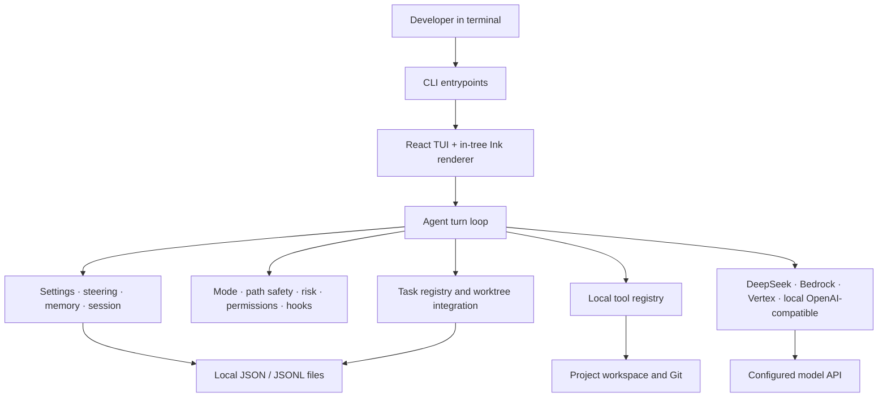

# Architecture

_Re-extracted on 2026-08-01 from v0.4.15. Confidence is 🟢 unless noted._

DeepSeek Code is a **single-process Bun terminal application**. It renders a React terminal UI, runs an agent loop locally, calls one configured model provider, and performs all workspace operations through a controlled tool boundary. It has no HTTP server, hosted proxy, relational database, queue, or deployed application container.

## Architectural shape

## Runtime boundaries

| Boundary | Technology / responsibility | Persistence / protocol |
| --- | --- | --- |
| CLI | Bun executable, command parsing, startup and pipe mode | terminal stdin/stdout |
| TUI | React 19, custom Ink-compatible reconciler, local Yoga layout | ANSI terminal writes |
| Agent | transcript, tool loop, provider adaptation, compaction, goals | in-process plus local session data |
| Authority | interaction modes, path safety, risk, permission rules, hooks | local settings and confirmations |
| Orchestration | bounded task graph, mailboxes, worktrees, integration | local snapshot/event files and Git |
| Extensions | skills, plugins, user-approved MCP, LSP | local directories / child processes |
| Providers | DeepSeek/OpenAI-compatible, AWS Bedrock, Google Vertex, local endpoints | HTTPS or provider SDK requests |

## Data ownership

The project source and Git checkout remain the user's assets. DeepSeek Code owns only local operational data: settings, session records, memory, task snapshots/events, audit logs, and extension registries. There is no source-defined relational schema. See [data dictionary](data-dictionary.md) and [ERD](erd-complete.md).

## External integrations

| Integration | Direction | Purpose | Authority boundary |
| --- | --- | --- | --- |
| Model provider | outbound HTTPS / SDK | model completion and tool-call responses | provider credentials/configuration |
| Git | local process | status, worktree isolation, diff application | workspace and risk checks |
| MCP server | local stdio | optional external tools | user MCP opt-in plus mode/risk gates |
| LSP server | local process | diagnostics/navigation | user-scoped command configuration |
| Git hosting source | outbound Git process | plugin/skill install/update | source/name validation |

## Important constraints

- All normal mutations flow through tool authorization; UI components do not write workspace files directly. 🟢
- Project configuration cannot turn repository content into executable authority. 🟢
- Orchestration is intentionally bounded by task count, depth, fan-out, timeout, retry and budget limits. 🟢
- A legacy browser-proxy/OAuth architecture is no longer part of the runtime. Vertex still uses Google authentication as a provider concern, which is distinct from the removed proxy OAuth flow. 🟢

## Technical debt and verification opportunities

| Item | Evidence / risk | Confidence |
| --- | --- | --- |
| Large central agent and TUI modules | `agent.ts` and `ui/App.tsx` coordinate several concerns, increasing change coupling. | 🟡 |
| Dual isolation paths | Worktree-first plus serialized fallback is safer but needs coverage around cleanup and integration edge cases. | 🟡 |
| Provider capability divergence | Bedrock, Vertex, and local providers expose different context/tool/streaming behavior. Contract tests should remain provider-specific. | 🟢 |
| Local persistence recovery | Snapshot/migration paths are safety-critical and deserve interruption/corruption tests. | 🟡 |

## Deliberately absent components

No Hono server, Playwright browser pool, browser API relay, API gateway, public REST API, or relational database exists in the current source tree. 🟢
