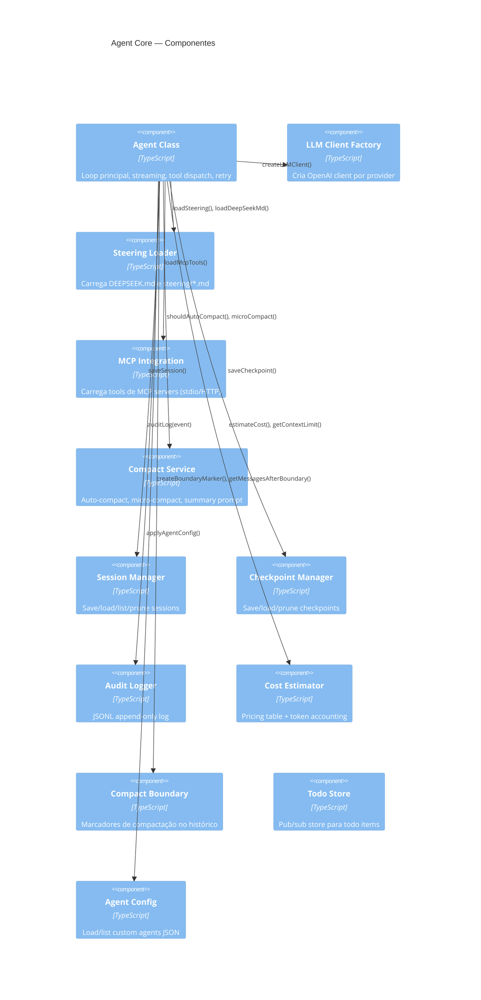
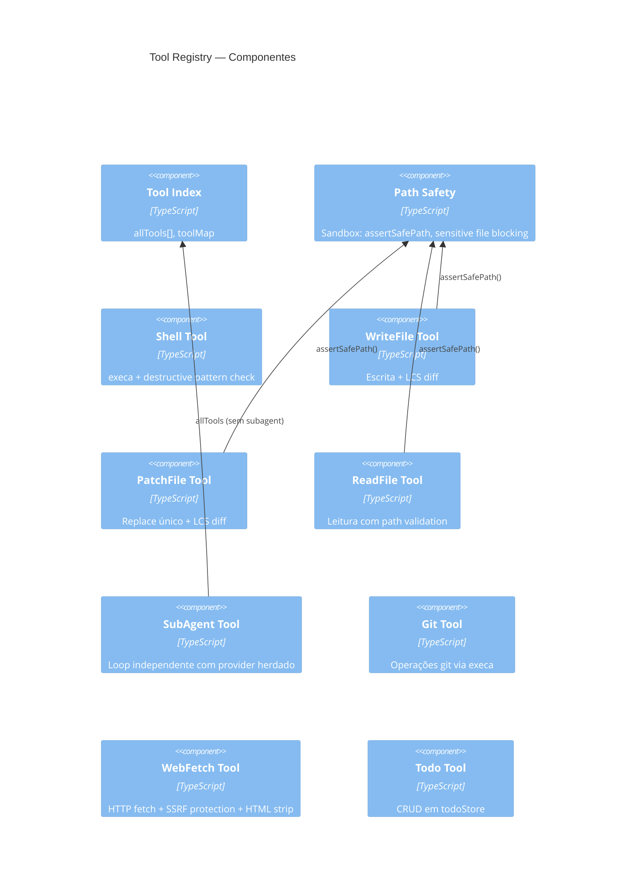
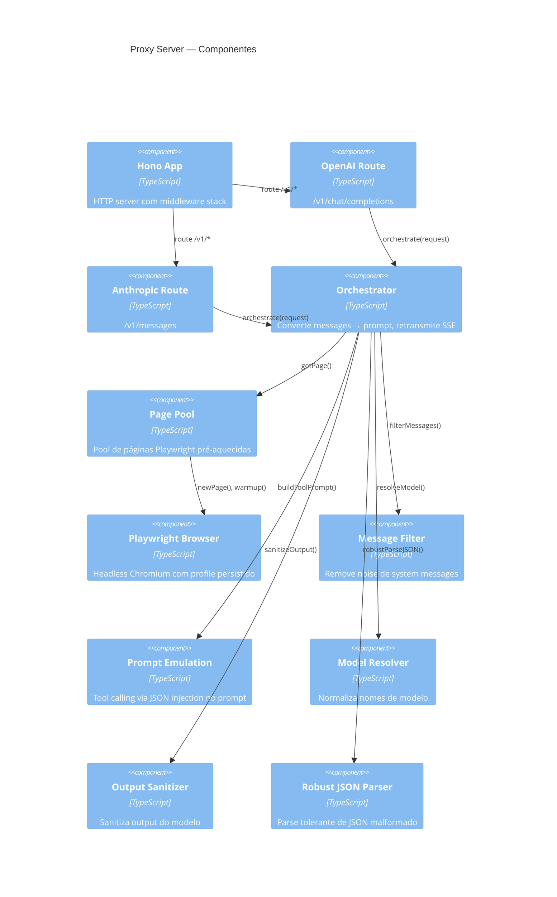

# C4 — Componentes (Nível 3)

> Gerado pelo Arquiteto (Reversa) em 2026-06-23

## Container: Agent Core

```mermaid
C4Component
    title Agent Core — Componentes

    Component(agentClass, "Agent Class", "TypeScript", "Loop principal, streaming, tool dispatch, retry")
    Component(llmClient, "LLM Client Factory", "TypeScript", "Cria OpenAI client por provider")
    Component(steering, "Steering Loader", "TypeScript", "Carrega DEEPSEEK.md e steering/*.md")
    Component(mcp, "MCP Integration", "TypeScript", "Carrega tools de MCP servers (stdio/HTTP)")
    Component(compact, "Compact Service", "TypeScript", "Auto-compact, micro-compact, summary prompt")
    Component(session, "Session Manager", "TypeScript", "Save/load/list/prune sessions")
    Component(checkpoint, "Checkpoint Manager", "TypeScript", "Save/load/prune checkpoints")
    Component(audit, "Audit Logger", "TypeScript", "JSONL append-only log")
    Component(cost, "Cost Estimator", "TypeScript", "Pricing table + token accounting")
    Component(boundary, "Compact Boundary", "TypeScript", "Marcadores de compactação no histórico")
    Component(todoStore, "Todo Store", "TypeScript", "Pub/sub store para todo items")
    Component(config, "Agent Config", "TypeScript", "Load/list custom agents JSON")

    Rel(agentClass, llmClient, "createLLMClient()")
    Rel(agentClass, steering, "loadSteering(), loadDeepSeekMd()")
    Rel(agentClass, mcp, "loadMcpTools()")
    Rel(agentClass, compact, "shouldAutoCompact(), microCompact()")
    Rel(agentClass, session, "saveSession()")
    Rel(agentClass, checkpoint, "saveCheckpoint()")
    Rel(agentClass, audit, "auditLog(event)")
    Rel(agentClass, cost, "estimateCost(), getContextLimit()")
    Rel(agentClass, boundary, "createBoundaryMarker(), getMessagesAfterBoundary()")
    Rel(agentClass, config, "applyAgentConfig()")
```

## Container: Tool Registry

```mermaid
C4Component
    title Tool Registry — Componentes

    Component(registry, "Tool Index", "TypeScript", "allTools[], toolMap")
    Component(pathSafety, "Path Safety", "TypeScript", "Sandbox: assertSafePath, sensitive file blocking")
    Component(shell, "Shell Tool", "TypeScript", "execa + destructive pattern check")
    Component(writeFile, "WriteFile Tool", "TypeScript", "Escrita + LCS diff")
    Component(patchFile, "PatchFile Tool", "TypeScript", "Replace único + LCS diff")
    Component(readFile, "ReadFile Tool", "TypeScript", "Leitura com path validation")
    Component(subAgent, "SubAgent Tool", "TypeScript", "Loop independente com provider herdado")
    Component(git, "Git Tool", "TypeScript", "Operações git via execa")
    Component(webFetch, "WebFetch Tool", "TypeScript", "HTTP fetch + SSRF protection + HTML strip")
    Component(todo, "Todo Tool", "TypeScript", "CRUD em todoStore")

    Rel(writeFile, pathSafety, "assertSafePath()")
    Rel(patchFile, pathSafety, "assertSafePath()")
    Rel(readFile, pathSafety, "assertSafePath()")
    Rel(subAgent, registry, "allTools (sem subagent)")
```

## Container: Proxy Server

```mermaid
C4Component
    title Proxy Server — Componentes

    Component(server, "Hono App", "TypeScript", "HTTP server com middleware stack")
    Component(openaiRoute, "OpenAI Route", "TypeScript", "/v1/chat/completions")
    Component(anthropicRoute, "Anthropic Route", "TypeScript", "/v1/messages")
    Component(orchestrator, "Orchestrator", "TypeScript", "Converte messages → prompt, retransmite SSE")
    Component(pool, "Page Pool", "TypeScript", "Pool de páginas Playwright pré-aquecidas")
    Component(playwright, "Playwright Browser", "TypeScript", "Headless Chromium com profile persistido")
    Component(messageFilter, "Message Filter", "TypeScript", "Remove noise de system messages")
    Component(promptEmulation, "Prompt Emulation", "TypeScript", "Tool calling via JSON injection no prompt")
    Component(modelResolver, "Model Resolver", "TypeScript", "Normaliza nomes de modelo")
    Component(outputSanitizer, "Output Sanitizer", "TypeScript", "Sanitiza output do modelo")
    Component(robustJson, "Robust JSON Parser", "TypeScript", "Parse tolerante de JSON malformado")

    Rel(server, openaiRoute, "route /v1/*")
    Rel(server, anthropicRoute, "route /v1/*")
    Rel(openaiRoute, orchestrator, "orchestrate(request)")
    Rel(anthropicRoute, orchestrator, "orchestrate(request)")
    Rel(orchestrator, pool, "getPage()")
    Rel(orchestrator, messageFilter, "filterMessages()")
    Rel(orchestrator, promptEmulation, "buildToolPrompt()")
    Rel(orchestrator, modelResolver, "resolveModel()")
    Rel(orchestrator, outputSanitizer, "sanitizeOutput()")
    Rel(orchestrator, robustJson, "robustParseJSON()")
    Rel(pool, playwright, "newPage(), warmup()")
```
