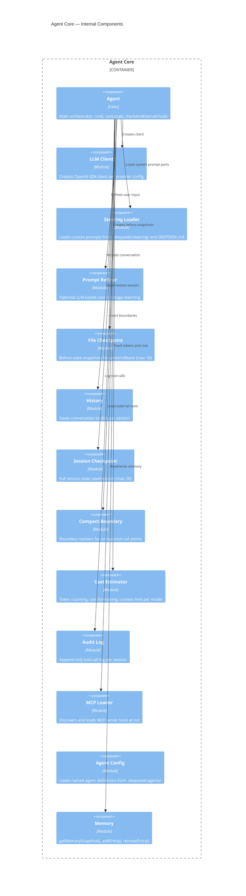
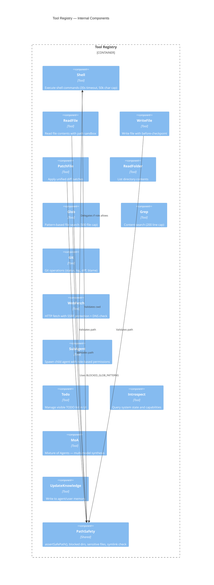
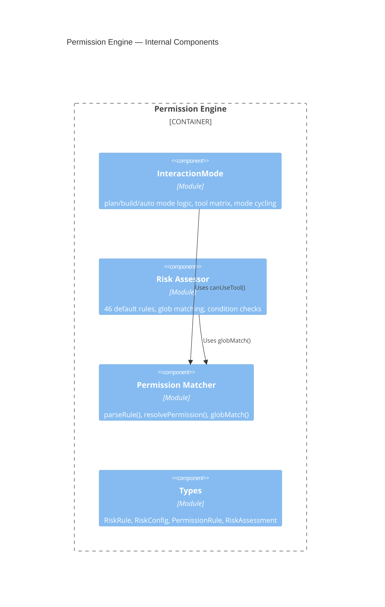
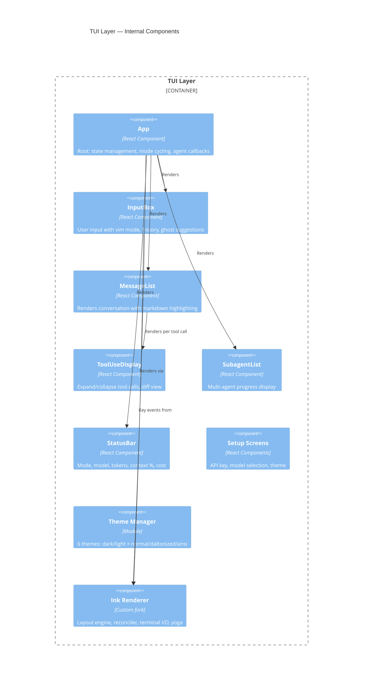
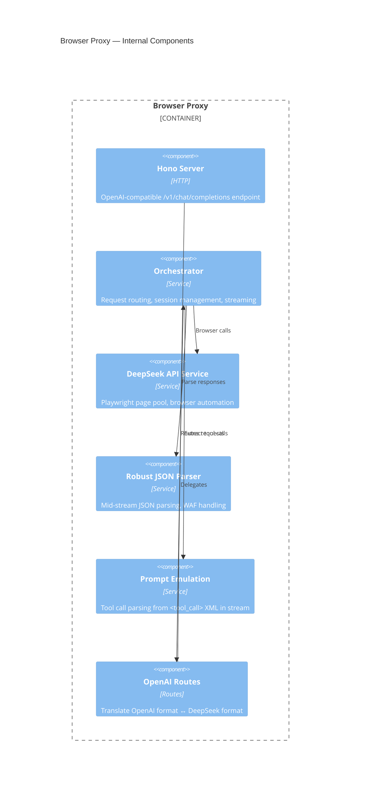

# C4 Components Diagram (Level 3)

> Confidence: 🟢 CONFIRMED  
> Generated at: 2026-07-01

## Agent Core — Components

## Tool Registry — Components

## Permission Engine — Components

## TUI Layer — Components

## Browser Proxy — Components

