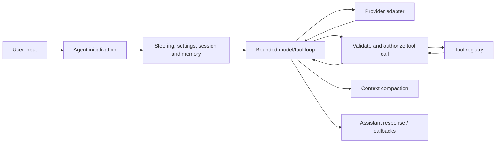
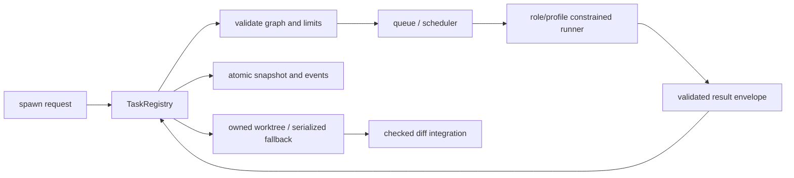

# C4 — Components

## Agent execution container

| Component | Primary responsibility |
| --- | --- |
| `Agent` | Coordinates initialization, transcript, provider calls, tools and callbacks. |
| provider adapters | Normalize DeepSeek/OpenAI-compatible, Bedrock, Vertex and local behavior. |
| memory/session | Supply safe persistent context and project-isolated history. |
| compaction service | Preserve a bounded useful transcript. |
| tool execution gate | Enforces mode, paths, risks, policy and hooks before calling a tool. |

## Task orchestration container

## TUI renderer container

The custom renderer reconciles React elements into terminal layout nodes and ANSI frames. It centralizes Unicode cell width, focus, scroll, resize and terminal ownership; application components describe UI rather than write raw stdout. 🟢
