# C4 Containers Diagram (Level 2)

> Confidence: 🟢 CONFIRMED  
> Generated at: 2026-07-01

## Container Diagram

```mermaid
C4Container
    title DeepSeek Code — Container Diagram

    Person(user, "Developer", "Terminal user")

    Container_Boundary(cli_boundary, "DeepSeek Code CLI") {
        Container(entrypoint, "CLI Entrypoint", "Bun + React", "Parses args, renders App via Ink")
        Container(agent, "Agent Core", "TypeScript class", "LLM conversation loop, tool orchestration, context management")
        Container(ui, "TUI Layer", "React + Custom Ink", "InputBox, MessageList, StatusBar, SubagentList, DiffView")
        Container(tools, "Tool Registry", "TypeScript modules", "15 tools: shell, file ops, git, grep, glob, web_fetch, MoA, subagent, etc.")
        Container(permissions, "Permission Engine", "TypeScript", "Mode check, risk assessment, glob matcher, deny/allow rules")
        Container(hooks, "Hook System", "Shell executor", "PreToolUse, PostToolUse, SessionStart lifecycle hooks")
        Container(settings, "Settings Manager", "TypeScript", "3-level merge: user → project → local")
        Container(compact, "Compaction Service", "TypeScript", "Auto-compact, micro-compact, boundary markers, summary LLM call")
        Container(providers, "Provider Layer", "OpenAI SDK + adapters", "Adapts DeepSeek/Bedrock/Vertex/Local to unified interface")
        Container(proxy, "Browser Proxy", "Hono + Playwright", "HTTP server translating OpenAI format → DeepSeek browser API")
        Container(remote, "Remote Control", "WebSocket + Crypto", "E2E encrypted mobile pairing, device trust store")
        Container(memory, "Memory Store", "Markdown files", "Persistent agent/user memory at ~/.deepseek-code/memory/")
        Container(state, "State Store", "In-memory singleton", "Session state: provider, model, tokens, context usage")
        Container(commands, "Command Router", "TypeScript", "26 slash commands: /help, /model, /effort, /rc, etc.")
    }

    System_Ext(deepseek_api, "DeepSeek API", "LLM inference")
    System_Ext(aws_bedrock, "AWS Bedrock", "DeepSeek on AWS")
    System_Ext(gcp_vertex, "Vertex AI", "DeepSeek on GCP")
    System_Ext(local_llm, "Local LLM", "Ollama / LM Studio")
    System_Ext(filesystem, "Filesystem", "Project files")
    System_Ext(relay, "WS Relay", "Remote control relay")
    System_Ext(mcp, "MCP Servers", "External tools")

    Rel(user, entrypoint, "Starts CLI", "Terminal")
    Rel(entrypoint, ui, "Renders", "React/Ink")
    Rel(ui, agent, "Sends user message", "Function call")
    Rel(agent, providers, "LLM requests", "OpenAI SDK")
    Rel(agent, tools, "Execute tools", "Function call")
    Rel(agent, permissions, "Check before execution", "Sync")
    Rel(agent, hooks, "Pre/Post lifecycle", "Shell spawn")
    Rel(agent, compact, "Context management", "Async")
    Rel(agent, memory, "Read/write memory", "File I/O")
    Rel(agent, state, "Update session state", "In-memory")
    Rel(tools, filesystem, "Read/Write/Exec", "fs + child_process")
    Rel(tools, mcp, "Discover + call tools", "MCP protocol")
    Rel(providers, deepseek_api, "Chat completions", "HTTPS")
    Rel(providers, aws_bedrock, "InvokeModel", "AWS SDK")
    Rel(providers, gcp_vertex, "Predict", "GCP SDK")
    Rel(providers, local_llm, "Chat completions", "HTTP")
    Rel(proxy, providers, "Translates format", "Internal HTTP")
    Rel(remote, relay, "E2E frames", "WebSocket")
    Rel(ui, commands, "Route slash commands", "Function call")
    Rel(settings, hooks, "Provides hook config", "Object pass")
    Rel(settings, permissions, "Provides permission rules", "Object pass")
```

## Container Summary

| Container | Technology | Responsibility | Lines (approx) |
|-----------|-----------|----------------|:--------------:|
| CLI Entrypoint | Bun + React | Parse args, bootstrap Ink renderer | ~100 |
| Agent Core | TypeScript (single class) | Conversation loop, tool dispatch, compaction | ~1259 |
| TUI Layer | React 19 + Custom Ink fork | Terminal UI rendering, input handling | ~3000 |
| Tool Registry | TypeScript modules | 15 built-in tools + MCP dynamic tools | ~2500 |
| Permission Engine | TypeScript | Mode gating, risk rules, glob matching | ~250 |
| Hook System | Shell executor | Lifecycle hooks via stdin/stdout JSON | ~150 |
| Settings Manager | TypeScript | Load, merge, strip hooks from untrusted levels | ~200 |
| Compaction Service | TypeScript | Auto-compact at 85%, micro-compact, LLM summary | ~150 |
| Provider Layer | OpenAI SDK + adapters | Unified LLM interface across 4 providers | ~500 |
| Browser Proxy | Hono + Playwright | DeepSeek browser API translation | ~1500 |
| Remote Control | WebSocket + libsodium | Mobile pairing, device trust, command relay | ~800 |
| Memory Store | Flat markdown files | Persistent knowledge (2000 char cap) | ~100 |
| State Store | In-memory singleton | Reactive state (provider, model, tokens) | ~65 |
| Command Router | TypeScript modules | 26 slash commands | ~1000 |
