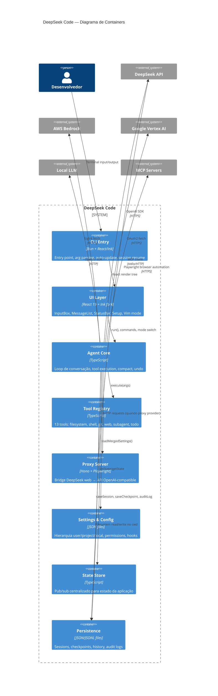

# C4 — Containers (Nível 2)

> Gerado pelo Arquiteto (Reversa) em 2026-06-23

```mermaid
C4Container
    title DeepSeek Code — Diagrama de Containers

    Person(dev, "Desenvolvedor")

    System_Boundary(deepseekCode, "DeepSeek Code") {
        Container(cli, "CLI Entry", "Bun + React/Ink", "Entry point, arg parsing, auto-update, session resume")
        Container(ui, "UI Layer", "React 19 + Ink fork", "InputBox, MessageList, StatusBar, Setup, Vim mode")
        Container(agent, "Agent Core", "TypeScript", "Loop de conversação, tool execution, compact, undo")
        Container(tools, "Tool Registry", "TypeScript", "13 tools: filesystem, shell, git, web, subagent, todo")
        Container(proxy, "Proxy Server", "Hono + Playwright", "Bridge DeepSeek web → API OpenAI-compatible")
        Container(settings, "Settings & Config", "JSON files", "Hierarquia user/project/local, permissions, hooks")
        Container(state, "State Store", "TypeScript", "Pub/sub centralizado para estado da aplicação")
        Container(persistence, "Persistence", "JSON/JSONL files", "Sessions, checkpoints, history, audit logs")
    }

    System_Ext(deepseekApi, "DeepSeek API")
    System_Ext(bedrock, "AWS Bedrock")
    System_Ext(vertex, "Google Vertex AI")
    System_Ext(localLlm, "Local LLM")
    System_Ext(mcpServers, "MCP Servers")

    Rel(dev, cli, "Terminal input/output")
    Rel(cli, ui, "React render tree")
    Rel(ui, agent, "run(), commands, mode switch")
    Rel(agent, tools, "execute(args)")
    Rel(agent, proxy, "HTTP requests (quando proxy provider)")
    Rel(agent, settings, "loadMergedSettings()")
    Rel(agent, state, "setState/getState")
    Rel(agent, persistence, "saveSession, saveCheckpoint, auditLog")
    Rel(agent, deepseekApi, "OpenAI SDK", "HTTPS")
    Rel(agent, bedrock, "SigV4 fetch", "HTTPS")
    Rel(agent, vertex, "OAuth2 fetch", "HTTPS")
    Rel(agent, localLlm, "OpenAI SDK", "HTTP")
    Rel(agent, mcpServers, "MCP client", "stdio/HTTP")
    Rel(proxy, deepseekApi, "Playwright browser automation", "HTTPS")
    Rel(tools, persistence, "Filesystem read/write no cwd")
```
