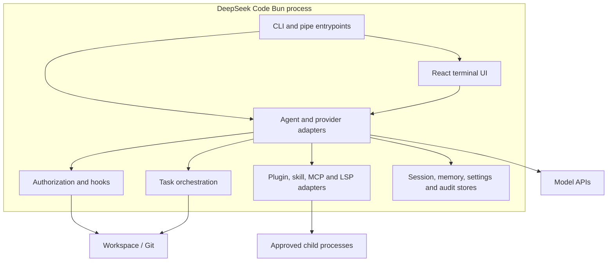

# C4 — Containers

The system is one local CLI process; these are logical runtime containers, not separately deployed services.

| Logical container | Responsibility | Technology |
| --- | --- | --- |
| CLI/pipe | Parse invocation, select flow, protect piped commands | Bun TypeScript |
| TUI | Conversation, prompts, approval surfaces, task presentation | React 19 + in-tree Ink/Yoga |
| Agent core | Initialize context, loop model/tools, compact and persist sessions | TypeScript + OpenAI SDK/provider adapters |
| Control plane | Mode, permissions, risk, hooks and safe paths | TypeScript |
| Orchestration | Task lifecycle, mailbox, worktree, snapshots and review | TypeScript + Git |
| Local stores | Operational state, atomically persisted/redacted where needed | JSON/JSONL + filesystem |
