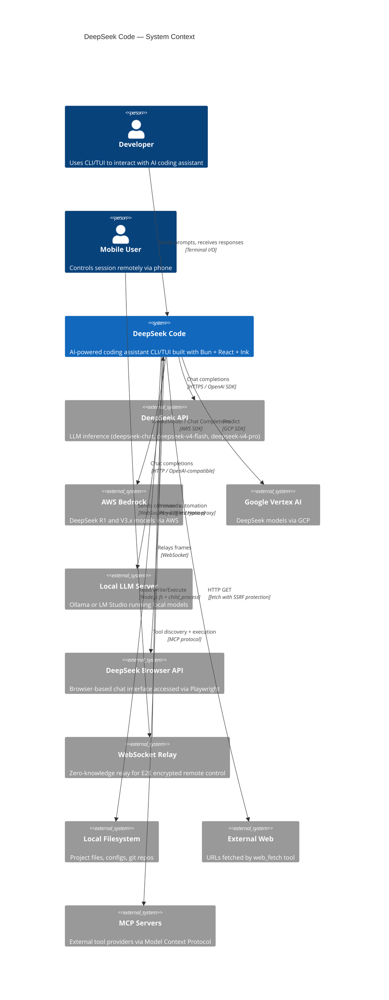

# C4 Context Diagram (Level 1)

> Confidence: 🟢 CONFIRMED  
> Generated at: 2026-07-01

## System Context

## Actors

| Actor | Type | Description |
|-------|------|-------------|
| Developer | Human | Primary user — interacts via terminal (keyboard input, visual output) |
| Mobile User | Human | Secondary — controls session from phone via QR-paired remote |

## External Systems

| System | Protocol | Purpose |
|--------|----------|---------|
| DeepSeek API | HTTPS (OpenAI SDK format) | Primary LLM provider — native API key auth |
| AWS Bedrock | AWS SDK (InvokeModel / Chat Completions) | Cloud LLM — DeepSeek R1, V3.x models |
| Google Vertex AI | GCP SDK (Predict) | Cloud LLM — DeepSeek models |
| Local LLM Server | HTTP (OpenAI-compatible) | Self-hosted via Ollama / LM Studio |
| DeepSeek Browser API | Playwright page pool → Hono proxy | Browser-based DeepSeek access |
| WebSocket Relay | WebSocket + Curve25519/XSalsa20 | Zero-knowledge relay for remote control |
| Local Filesystem | POSIX fs | Project files, git repos, configs |
| External Web | HTTPS | URLs fetched by web_fetch tool (SSRF-protected) |
| MCP Servers | MCP protocol | External tools (stdio/SSE transport) |
