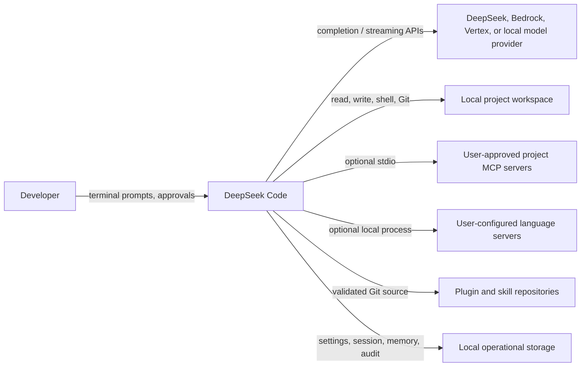

# C4 — System context

| Actor/system | Relationship | Confidence |
| --- | --- | --- |
| Developer | Starts the CLI, supplies prompts, chooses modes, and confirms elevated actions. | 🟢 |
| Model provider | Generates assistant content and tool-call requests through selected provider adapters. | 🟢 |
| Local workspace | Is the agent's controlled operating target. | 🟢 |
| MCP/LSP | Optional local process integrations requiring user-scope authorization. | 🟢 |
| Extension source | Supplies validated skills/plugins during explicit management commands. | 🟢 |
