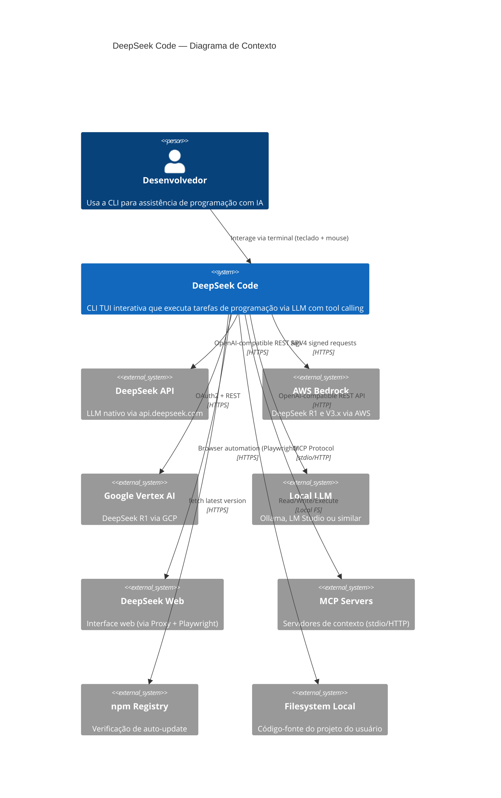

# C4 — Contexto (Nível 1)

> Gerado pelo Arquiteto (Reversa) em 2026-06-23

```mermaid
C4Context
    title DeepSeek Code — Diagrama de Contexto

    Person(dev, "Desenvolvedor", "Usa a CLI para assistência de programação com IA")

    System(deepseekCode, "DeepSeek Code", "CLI TUI interativa que executa tarefas de programação via LLM com tool calling")

    System_Ext(deepseekApi, "DeepSeek API", "LLM nativo via api.deepseek.com")
    System_Ext(bedrock, "AWS Bedrock", "DeepSeek R1 e V3.x via AWS")
    System_Ext(vertex, "Google Vertex AI", "DeepSeek R1 via GCP")
    System_Ext(localLlm, "Local LLM", "Ollama, LM Studio ou similar")
    System_Ext(deepseekWeb, "DeepSeek Web", "Interface web (via Proxy + Playwright)")
    System_Ext(mcpServers, "MCP Servers", "Servidores de contexto (stdio/HTTP)")
    System_Ext(npmRegistry, "npm Registry", "Verificação de auto-update")
    System_Ext(filesystem, "Filesystem Local", "Código-fonte do projeto do usuário")

    Rel(dev, deepseekCode, "Interage via terminal (teclado + mouse)")
    Rel(deepseekCode, deepseekApi, "OpenAI-compatible REST API", "HTTPS")
    Rel(deepseekCode, bedrock, "SigV4 signed requests", "HTTPS")
    Rel(deepseekCode, vertex, "OAuth2 + REST", "HTTPS")
    Rel(deepseekCode, localLlm, "OpenAI-compatible REST API", "HTTP")
    Rel(deepseekCode, deepseekWeb, "Browser automation (Playwright)", "HTTPS")
    Rel(deepseekCode, mcpServers, "MCP Protocol", "stdio/HTTP")
    Rel(deepseekCode, npmRegistry, "fetch latest version", "HTTPS")
    Rel(deepseekCode, filesystem, "Read/Write/Execute", "Local FS")
```
