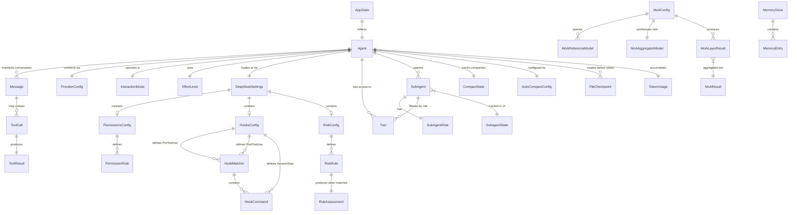

# Entity-Relationship Diagram (Complete)

> Confidence: 🟢 CONFIRMED  
> Generated at: 2026-07-01

## Overview

DeepSeek Code does **not** use a database — all persistence is via JSON/Markdown files and in-memory state. This ERD maps the logical entities and their relationships as they exist in the type system and runtime.

## ERD

## Entity Details

### Agent (runtime singleton)
| Field | Type | Description |
|-------|------|-------------|
| messages | Message[] | Full conversation history |
| model | string | Active LLM model name |
| provider | ProviderName | `deepseek` \| `bedrock` \| `vertex` \| `local` |
| interactionMode | InteractionMode | `plan` \| `build` \| `auto` |
| effortLevel | EffortLevel | `low` \| `high` \| `max` |
| tokenCount | number | Total tokens consumed this session |
| contextUsage | number | Current prompt token count |
| contextLimit | number | Max tokens for current model |
| turnWriteCount | number | Write operations this turn (for burst detection) |
| sessionApprovedTools | Set\<string\> | Content-scoped approvals this session |
| tools | Tool[] | All available tools (built-in + MCP) |
| settings | DeepSeekSettings | Merged settings |
| compactState | CompactState | Consecutive failures, last compact timestamp |

### Message
| Field | Type | Description |
|-------|------|-------------|
| role | `system` \| `user` \| `assistant` \| `tool` | Message role |
| content | string \| null | Text content |
| reasoning_content | string? | DeepSeek thinking/reasoning (optional) |
| tool_calls | ToolCall[]? | Requested tool invocations |
| tool_call_id | string? | For tool role: which call this responds to |

### ToolCall
| Field | Type | Description |
|-------|------|-------------|
| id | string | Unique identifier |
| type | `function` | Always "function" |
| function.name | string | Tool name |
| function.arguments | string | JSON-encoded args |

### ProviderConfig
| Field | Type | Description |
|-------|------|-------------|
| provider | ProviderName | `deepseek` \| `bedrock` \| `vertex` \| `local` |
| apiKey | string? | DeepSeek API key |
| baseURL | string? | Custom API endpoint |
| awsRegion | string? | AWS region for Bedrock |
| awsProfile | string? | AWS profile name |
| gcpProject | string? | GCP project ID |
| gcpLocation | string? | GCP region |
| localBaseUrl | string? | Ollama/LM Studio URL |
| localModel | string? | Model name for local provider |

### SubagentState (UI tracking)
| Field | Type | Description |
|-------|------|-------------|
| id | string | Unique agent ID |
| task | string | Task description |
| status | SubagentStatus | `running` \| `done` \| `error` |
| role | SubAgentRole | `reader` \| `writer` \| `executor` \| `reviewer` \| `unrestricted` |
| toolCount | number | Tools executed |
| tokens | number? | Tokens consumed |
| costUsd | number? | Estimated cost |
| confidence | number? | Result confidence score |
| verified | boolean? | Verification status |

### RiskRule
| Field | Type | Description |
|-------|------|-------------|
| id | string | Human-readable key (e.g., `shell:rm`) |
| level | RiskLevel | `high` \| `medium` |
| tool | string? | Target tool name |
| pattern | string? | Glob pattern for content matching |
| condition | string? | `large_overwrite` \| `multi_edit_burst` \| etc. |

### MoAConfig
| Field | Type | Description |
|-------|------|-------------|
| referenceModels | MoAReferenceModel[] | Models queried in parallel |
| aggregator | MoAAggregatorModel | Model that synthesizes responses |
| minResponses | number | Minimum required before synthesis (default: 1) |
| timeoutMs | number | Per-model timeout (default: 60000) |

### MemoryStore
| Field | Type | Description |
|-------|------|-------------|
| target | `agent` \| `user` | Which memory file |
| entries | string[] | Delimiter-separated entries |
| maxChars | 2000 | Hard cap on total content |

### AppState (reactive store)
| Field | Type | Description |
|-------|------|-------------|
| sessionId | string | Current session UUID |
| provider | string | Active provider name |
| model | string | Active model |
| tokenCount | number | Total tokens |
| contextUsage | number | Current context usage |
| contextLimit | number | Context window size |
| activeAgent | string? | Currently running agent name |
| isProcessing | boolean | Whether agent is responding |

## Persistence Model

| Data | Storage | Location | Lifetime |
|------|---------|----------|----------|
| Conversation history | JSON | `~/.deepseek-code/history/` | Per-session file |
| Session checkpoints | JSON | `~/.deepseek-code/checkpoints/` | Max 20, auto-evict |
| Agent memory | Markdown | `~/.deepseek-code/memory/MEMORY.md` | Persistent (2k cap) |
| User preferences | Markdown | `~/.deepseek-code/memory/USER.md` | Persistent (2k cap) |
| Audit log | JSON lines | `~/.deepseek-code/audit/` | Per-session file |
| File checkpoints (undo) | JSON + file content | In-memory | Per-session (max 10) |
| Settings | JSON | 3 levels (see Settings) | Persistent files |
| Device trust store | JSON | `~/.deepseek-code/devices/` | Persistent |
