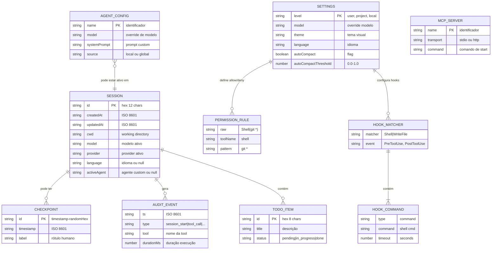

# ERD — deepseek-code

> Gerado pelo Arquiteto (Reversa) em 2026-06-23
> Nota: Este projeto não usa banco de dados relacional. O ERD representa as entidades persistidas em JSON.

## Cardinalidades

| Relação | Cardinalidade | Nota |
|---------|---------------|------|
| Session → Checkpoint | 1:N | Max 20 checkpoints globais |
| Session → AuditEvent | 1:N | Um arquivo JSONL por sessão |
| Session → TodoItem | 1:N | In-memory, não persistido |
| Settings → PermissionRule | 1:N | Arrays allow[] e deny[] |
| Settings → HookMatcher | 1:N | Por evento (Pre/Post/Session) |
| HookMatcher → HookCommand | 1:N | Lista de hooks por matcher |
| AgentConfig → Session | N:1 | Um agent ativo por sessão |

## Persistência

| Entidade | Formato | Local |
|----------|---------|-------|
| Session | JSON | `~/.deepseek/sessions/{id}.json` |
| Checkpoint | JSON | `~/.deepseek/checkpoints/{id}.json` |
| AgentConfig | JSON | `.deepseek/agents/` ou `~/.deepseek/agents/` |
| Settings | JSON | `~/.deepseek/settings.json`, `.deepseek/settings.json`, `.deepseek/settings.local.json` |
| AuditEvent | JSONL | `~/.deepseek/logs/session-{id}.jsonl` |
| TodoItem | In-memory | Não persistido entre sessões |
| History | JSON | `~/.deepseek/history.json` (max 500 msgs) |
