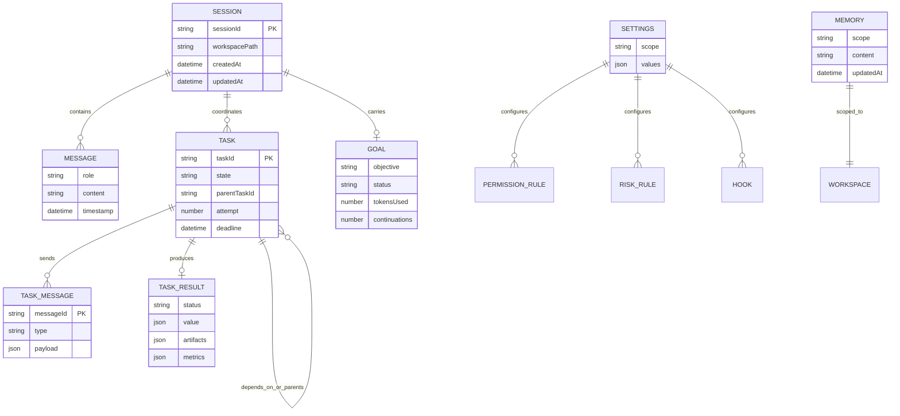

# Persisted-record diagram

This is an ERD-style view of operational records, not a relational database schema. Records are stored in local JSON/JSONL files and their exact serializations are versioned by TypeScript types. 🟢

| Record | Canonical source | Key constraints |
| --- | --- | --- |
| Session | `agent/session.ts` | workspace-derived storage isolation; exports redact secrets. |
| Goal | `agent/goal.ts` | one current in-memory goal; bounded continuation/blocker lifecycle. |
| Task | `orchestration/types.ts` | unique id, legal state transition, valid acyclic dependencies. |
| Task result/message | orchestration schemas/types | versioned envelope, idempotent message identity. |
| Settings | `settings/types.ts` | hierarchy plus scope-specific executable restrictions. |
| Memory | `agent/memory.ts` | user/project scope, bounded content, untrusted text filtering. |
