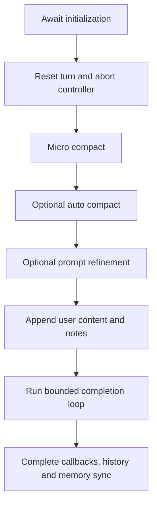

# `Agent.run()` detail

```mermaid
flowchart TD
  A[Await initialization] --> B[Reset turn and abort controller]
  B --> C[Micro compact]
  C --> D[Optional auto compact]
  D --> E[Optional prompt refinement]
  E --> F[Append user content and notes]
  F --> G[Run bounded completion loop]
  G --> H[Complete callbacks, history and memory sync]
```
