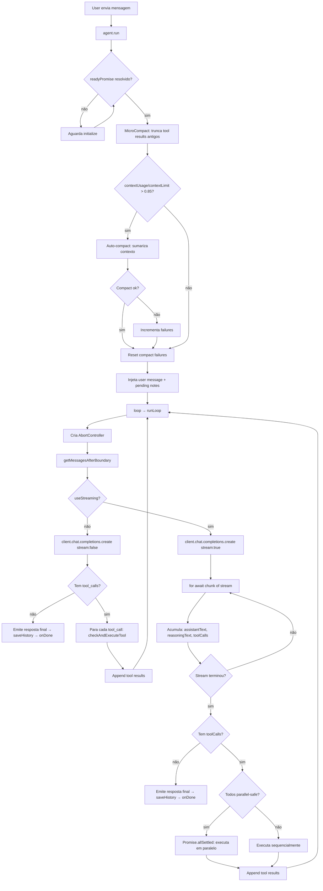
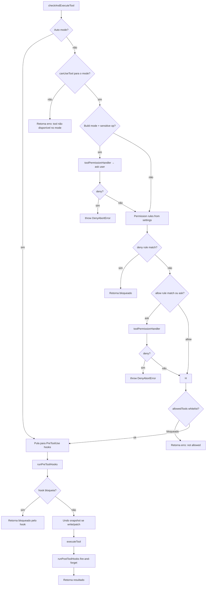

# Flowchart — Módulo Agent (Loop Principal)

> Gerado pelo Arqueólogo (Reversa) em 2026-06-23

```mermaid
flowchart TD
    A[User envia mensagem] --> B[agent.run]
    B --> C{readyPromise resolvido?}
    C -->|não| C1[Aguarda initialize]
    C1 --> C
    C -->|sim| D[MicroCompact: trunca tool results antigos]
    D --> E{contextUsage/contextLimit > 0.85?}
    E -->|sim| F[Auto-compact: sumariza contexto]
    F --> G{Compact ok?}
    G -->|sim| H[Reset compact failures]
    G -->|não| G1[Incrementa failures]
    G1 --> H
    E -->|não| H
    H --> I[Injeta user message + pending notes]
    I --> J[loop → runLoop]

    J --> K[Cria AbortController]
    K --> L[getMessagesAfterBoundary]
    L --> M{useStreaming?}

    %% Non-streaming path
    M -->|não| N[client.chat.completions.create stream:false]
    N --> O{Tem tool_calls?}
    O -->|não| P[Emite resposta final → saveHistory → onDone]
    O -->|sim| Q[Para cada tool_call: checkAndExecuteTool]
    Q --> R[Append tool results]
    R --> J

    %% Streaming path
    M -->|sim| S[client.chat.completions.create stream:true]
    S --> T[for await chunk of stream]
    T --> U[Acumula: assistantText, reasoningText, toolCalls]
    U --> V{Stream terminou?}
    V -->|não| T
    V -->|sim| W{Tem toolCalls?}
    W -->|não| X[Emite resposta final → saveHistory → onDone]
    W -->|sim| Y{Todos parallel-safe?}
    Y -->|sim| Z[Promise.allSettled: executa em paralelo]
    Y -->|não| AA[Executa sequencialmente]
    Z --> AB[Append tool results]
    AA --> AB
    AB --> J
```

---

## checkAndExecuteTool

```mermaid
flowchart TD
    A[checkAndExecuteTool] --> B{Auto mode?}
    B -->|sim| HOOKS[Pula para PreToolUse hooks]
    B -->|não| C{canUseTool para o mode?}
    C -->|não| D[Retorna erro: tool não disponível no mode]
    C -->|sim| E{Build mode + sensitive op?}
    E -->|sim| F[toolPermissionHandler → ask user]
    F --> F1{deny?}
    F1 -->|sim| F2[throw DenyAbortError]
    F1 -->|não| G
    E -->|não| G[Permission rules from settings]
    G --> G1{deny rule match?}
    G1 -->|sim| G2[Retorna bloqueado]
    G1 -->|não| G3{allow rule match ou ask?}
    G3 -->|ask| G4[toolPermissionHandler]
    G4 --> G5{deny?}
    G5 -->|sim| G6[throw DenyAbortError]
    G5 -->|não| H
    G3 -->|allow| H
    H --> H1{allowedTools whitelist?}
    H1 -->|bloqueado| H2[Retorna erro: not allowed]
    H1 -->|ok| HOOKS

    HOOKS --> I[runPreToolHooks]
    I --> I1{hook bloqueia?}
    I1 -->|sim| I2[Retorna bloqueado pelo hook]
    I1 -->|não| J[Undo snapshot se write/patch]
    J --> K[executeTool]
    K --> L[runPostToolHooks fire-and-forget]
    L --> M[Retorna resultado]
```
