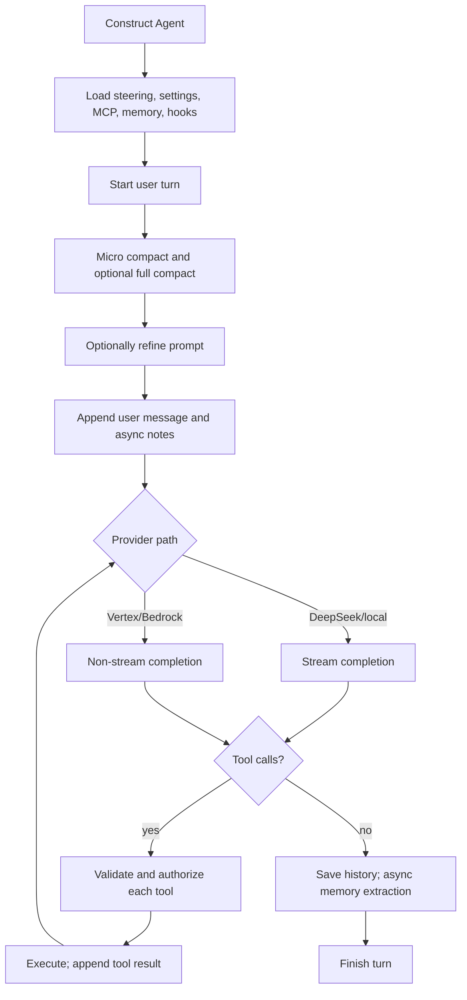

# Agent flow

```mermaid
flowchart TD
  A[Construct Agent] --> B[Load steering, settings, MCP, memory, hooks]
  B --> C[Start user turn]
  C --> D[Micro compact and optional full compact]
  D --> E[Optionally refine prompt]
  E --> F[Append user message and async notes]
  F --> G{Provider path}
  G -->|DeepSeek/local| H[Stream completion]
  G -->|Vertex/Bedrock| I[Non-stream completion]
  H --> J{Tool calls?}
  I --> J
  J -->|yes| K[Validate and authorize each tool]
  K --> L[Execute; append tool result]
  L --> G
  J -->|no| M[Save history; async memory extraction]
  M --> N[Finish turn]
```
