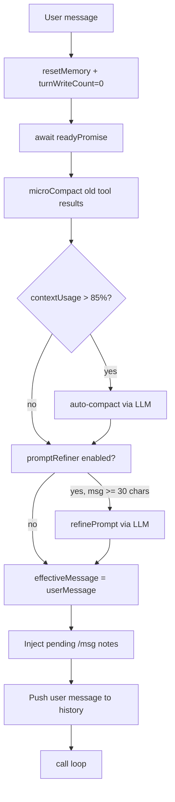
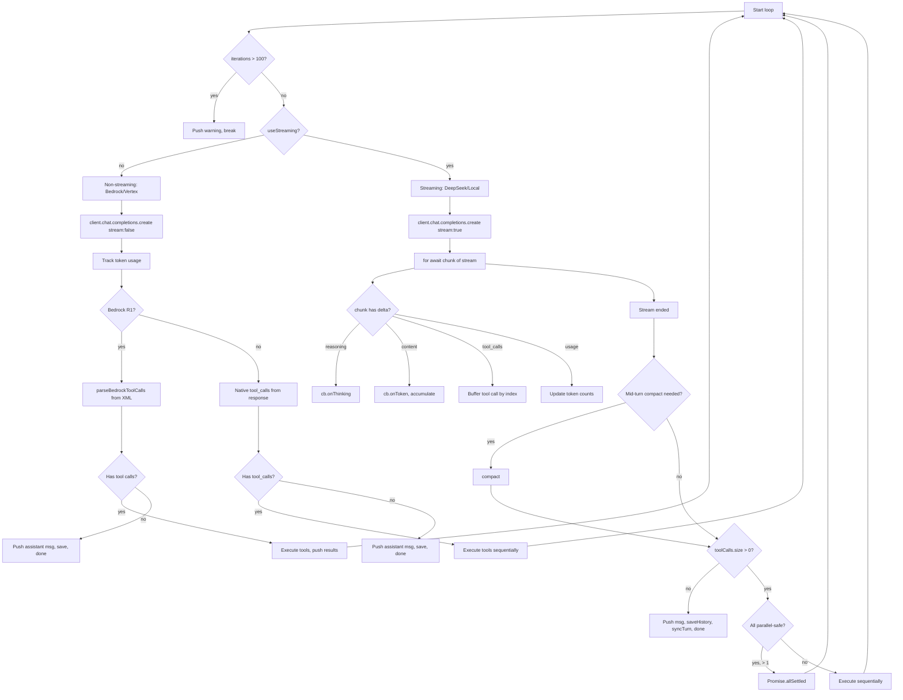
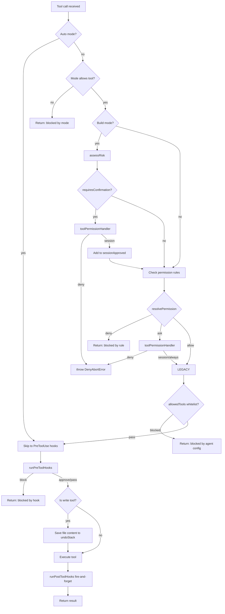
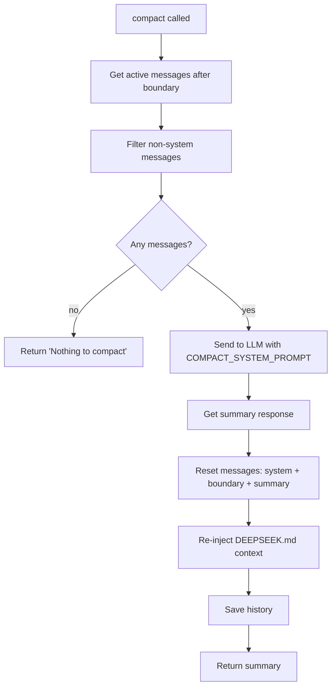
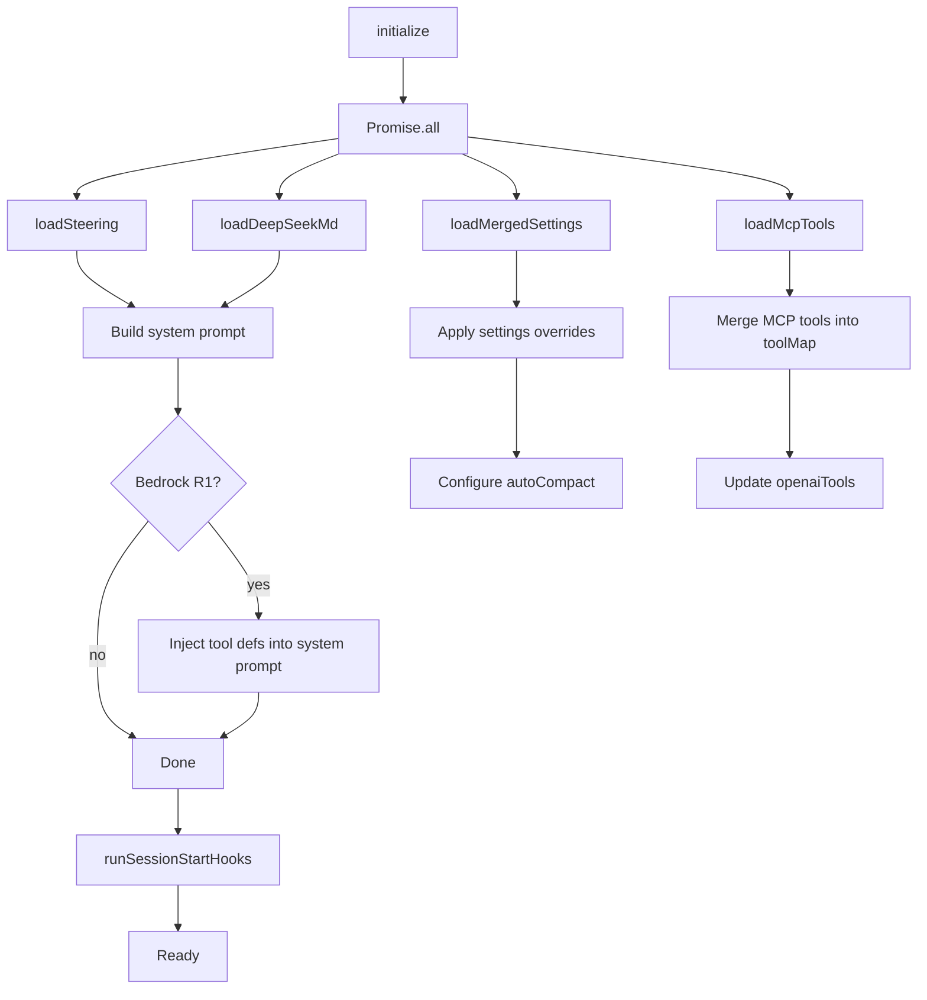

# Flowchart: Agent Module

> Confidence: 🟢 CONFIRMED  
> Generated at: 2026-07-01

## Agent.run() — Main Entry Point

## Agent.runLoop() — Core Agent Loop

## Agent.checkAndExecuteTool() — Permission Pipeline

## Agent.compact() — Context Compaction

## Agent.initialize() — Async Initialization

