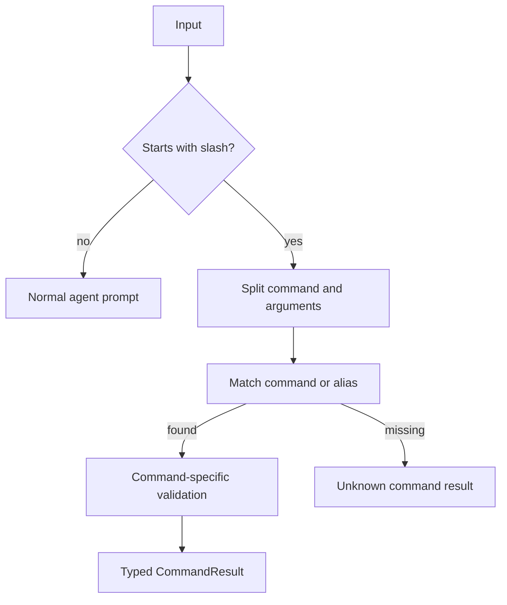

# Command parsing flow

```mermaid
flowchart TD
  A[Input] --> B{Starts with slash?}
  B -->|no| C[Normal agent prompt]
  B -->|yes| D[Split command and arguments]
  D --> E[Match command or alias]
  E -->|found| F[Command-specific validation]
  F --> G[Typed CommandResult]
  E -->|missing| H[Unknown command result]
```
