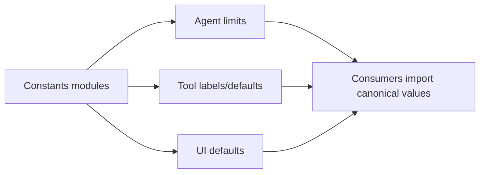

# Constants flow

```mermaid
flowchart LR
  A[Constants modules] --> B[Agent limits]
  A --> C[Tool labels/defaults]
  A --> D[UI defaults]
  B --> E[Consumers import canonical values]
  C --> E
  D --> E
```
