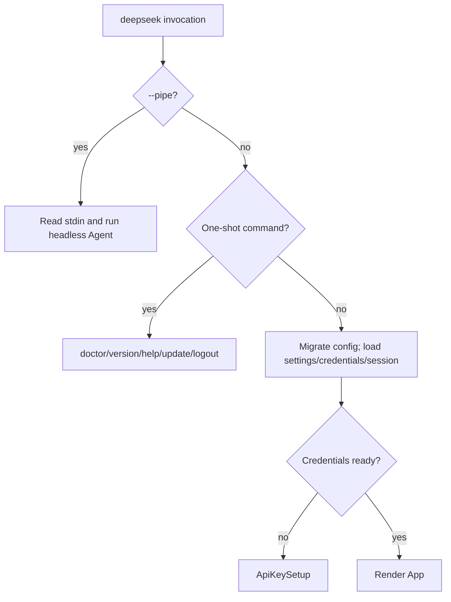

# Startup flow

```mermaid
flowchart TD
  A[deepseek invocation] --> B{--pipe?}
  B -->|yes| C[Read stdin and run headless Agent]
  B -->|no| D{One-shot command?}
  D -->|yes| E[doctor/version/help/update/logout]
  D -->|no| F[Migrate config; load settings/credentials/session]
  F --> G{Credentials ready?}
  G -->|no| H[ApiKeySetup]
  G -->|yes| I[Render App]
```
