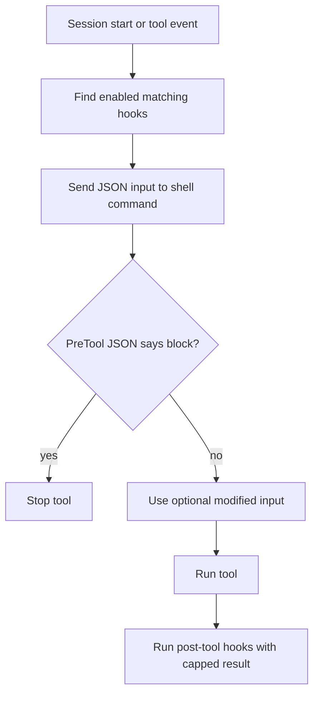

# Hook flow

```mermaid
flowchart TD
  A[Session start or tool event] --> B[Find enabled matching hooks]
  B --> C[Send JSON input to shell command]
  C --> D{PreTool JSON says block?}
  D -->|yes| E[Stop tool]
  D -->|no| F[Use optional modified input]
  F --> G[Run tool]
  G --> H[Run post-tool hooks with capped result]
```
