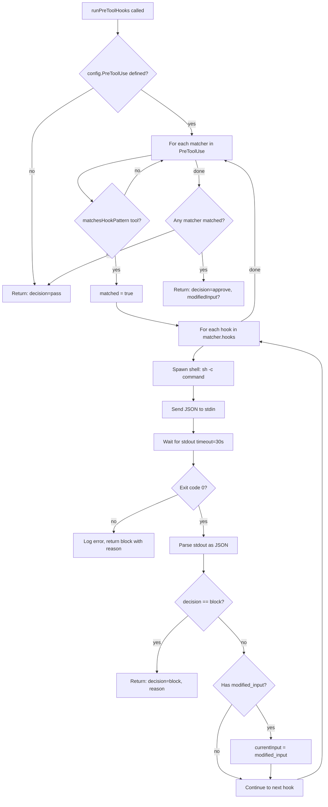
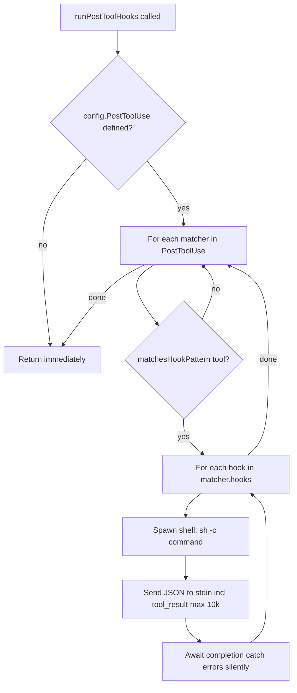
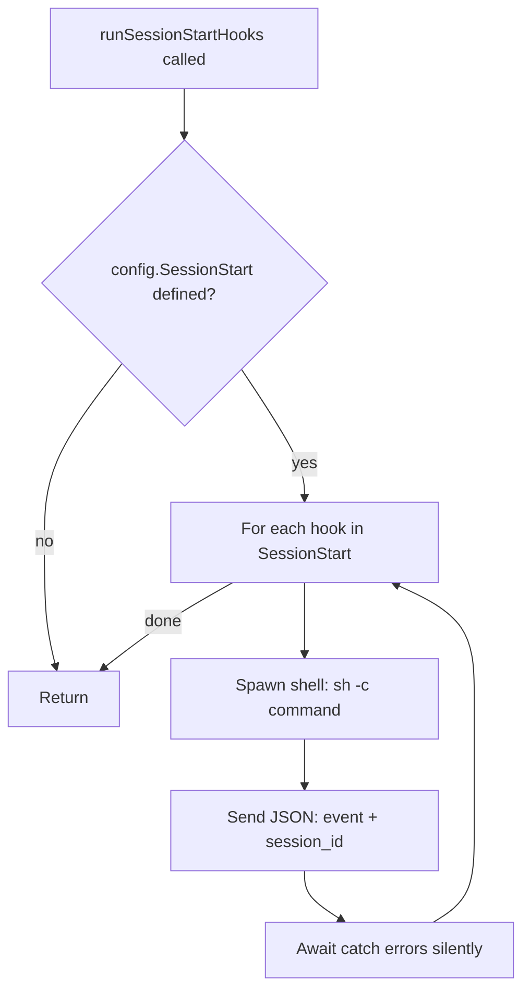
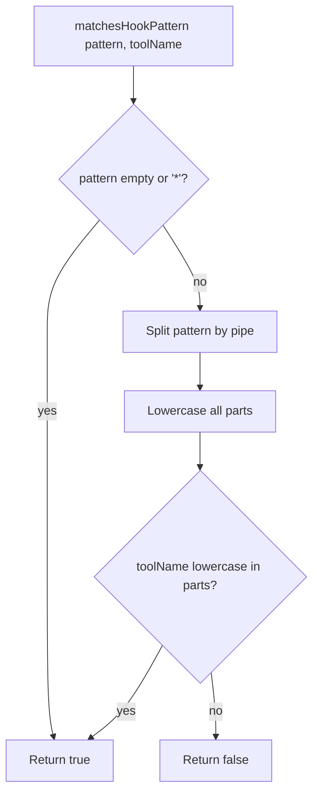

# Flowchart: Hooks Module

> Confidence: 🟢 CONFIRMED  
> Generated at: 2026-07-01

## PreToolUse Hook Execution

## PostToolUse Hook Execution

## SessionStart Hook Execution

## Hook Pattern Matching

