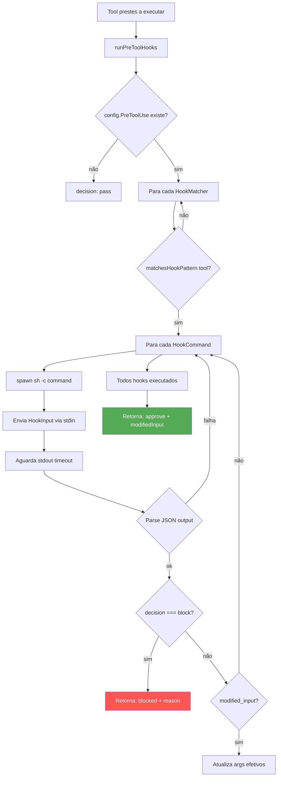
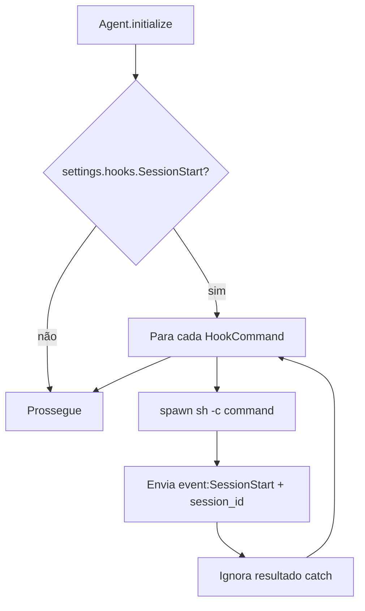
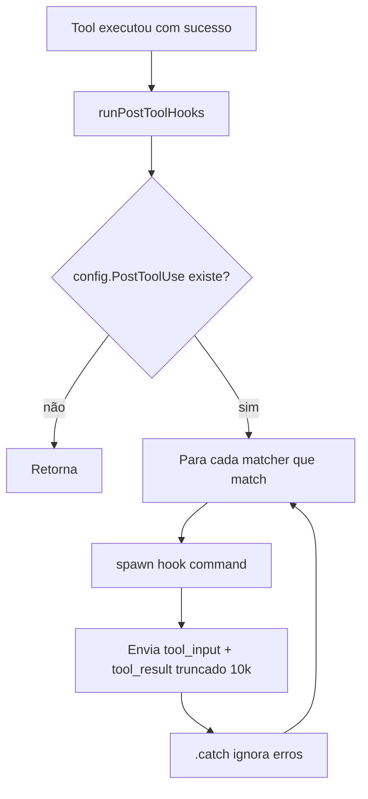

# Flowchart — Módulo Hooks

> Gerado pelo Arqueólogo (Reversa) em 2026-06-23

```mermaid
flowchart TD
    A[Tool prestes a executar] --> B[runPreToolHooks]
    B --> C{config.PreToolUse existe?}
    C -->|não| D[decision: pass]
    C -->|sim| E[Para cada HookMatcher]
    E --> F{matchesHookPattern tool?}
    F -->|não| E
    F -->|sim| G[Para cada HookCommand]
    G --> H[spawn sh -c command]
    H --> I[Envia HookInput via stdin]
    I --> J[Aguarda stdout timeout]
    J --> K{Parse JSON output}
    K -->|falha| G
    K -->|ok| L{decision === block?}
    L -->|sim| M[Retorna: blocked + reason]
    L -->|não| N{modified_input?}
    N -->|sim| O[Atualiza args efetivos]
    N -->|não| G
    G --> P[Todos hooks executados]
    P --> Q[Retorna: approve + modifiedInput]

    style M fill:#f55,color:#fff
    style Q fill:#5a5,color:#fff
```

## SessionStart Hooks

```mermaid
flowchart TD
    A[Agent.initialize] --> B{settings.hooks.SessionStart?}
    B -->|não| C[Prossegue]
    B -->|sim| D[Para cada HookCommand]
    D --> E[spawn sh -c command]
    E --> F[Envia event:SessionStart + session_id]
    F --> G[Ignora resultado catch]
    G --> D
    D --> C
```

## PostToolUse Hooks (Fire-and-forget)

```mermaid
flowchart TD
    A[Tool executou com sucesso] --> B[runPostToolHooks]
    B --> C{config.PostToolUse existe?}
    C -->|não| D[Retorna]
    C -->|sim| E[Para cada matcher que match]
    E --> F[spawn hook command]
    F --> G[Envia tool_input + tool_result truncado 10k]
    G --> H[.catch ignora erros]
    H --> E
```
