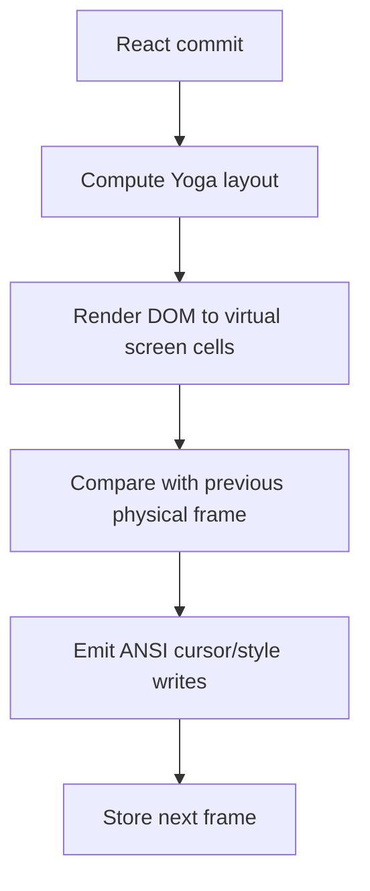

# Renderer frame detail

```mermaid
flowchart TD
  A[React commit] --> B[Compute Yoga layout]
  B --> C[Render DOM to virtual screen cells]
  C --> D[Compare with previous physical frame]
  D --> E[Emit ANSI cursor/style writes]
  E --> F[Store next frame]
```
