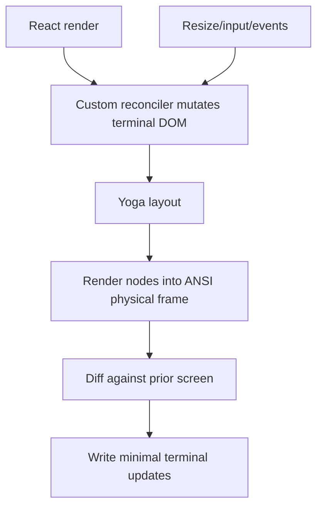

# Terminal renderer flow

```mermaid
flowchart TD
  A[React render] --> B[Custom reconciler mutates terminal DOM]
  B --> C[Yoga layout]
  C --> D[Render nodes into ANSI physical frame]
  D --> E[Diff against prior screen]
  E --> F[Write minimal terminal updates]
  G[Resize/input/events] --> B
```
