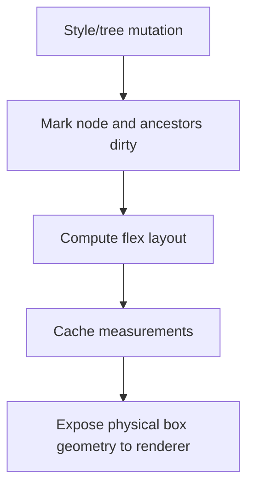

# Yoga layout flow

```mermaid
flowchart TD
  A[Style/tree mutation] --> B[Mark node and ancestors dirty]
  B --> C[Compute flex layout]
  C --> D[Cache measurements]
  D --> E[Expose physical box geometry to renderer]
```
