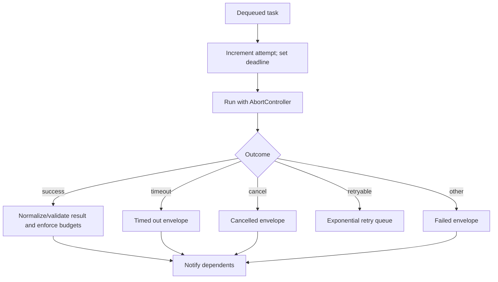

# `TaskRegistry.run()` detail

```mermaid
flowchart TD
  A[Dequeued task] --> B[Increment attempt; set deadline]
  B --> C[Run with AbortController]
  C --> D{Outcome}
  D -->|success| E[Normalize/validate result and enforce budgets]
  D -->|timeout| F[Timed out envelope]
  D -->|cancel| G[Cancelled envelope]
  D -->|retryable| H[Exponential retry queue]
  D -->|other| I[Failed envelope]
  E --> J[Notify dependents]
  F --> J
  G --> J
  I --> J
```
