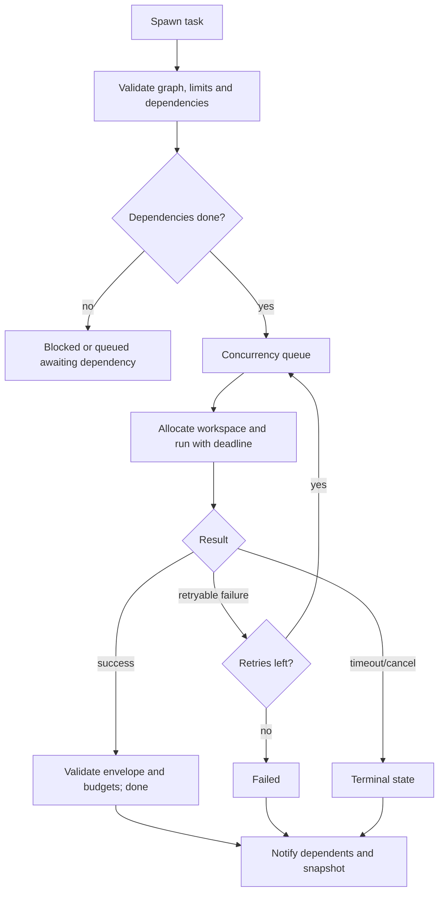

# Orchestration flow

```mermaid
flowchart TD
  A[Spawn task] --> B[Validate graph, limits and dependencies]
  B --> C{Dependencies done?}
  C -->|no| D[Blocked or queued awaiting dependency]
  C -->|yes| E[Concurrency queue]
  E --> F[Allocate workspace and run with deadline]
  F --> G{Result}
  G -->|success| H[Validate envelope and budgets; done]
  G -->|retryable failure| I{Retries left?}
  I -->|yes| E
  I -->|no| J[Failed]
  G -->|timeout/cancel| K[Terminal state]
  H --> L[Notify dependents and snapshot]
  J --> L
  K --> L
```
