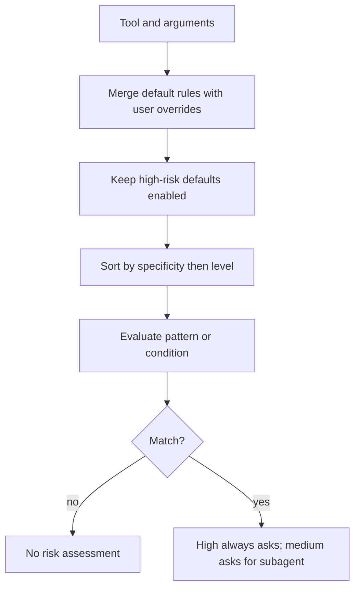

# `assessRisk()` detail

```mermaid
flowchart TD
  A[Tool and arguments] --> B[Merge default rules with user overrides]
  B --> C[Keep high-risk defaults enabled]
  C --> D[Sort by specificity then level]
  D --> E[Evaluate pattern or condition]
  E --> F{Match?}
  F -->|no| G[No risk assessment]
  F -->|yes| H[High always asks; medium asks for subagent]
```
