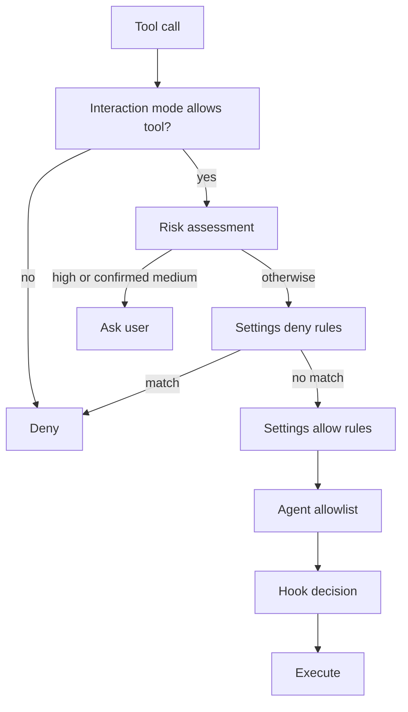

# Permission decision flow

```mermaid
flowchart TD
  A[Tool call] --> B[Interaction mode allows tool?]
  B -->|no| X[Deny]
  B -->|yes| C[Risk assessment]
  C -->|high or confirmed medium| D[Ask user]
  C -->|otherwise| E[Settings deny rules]
  E -->|match| X
  E -->|no match| F[Settings allow rules]
  F --> G[Agent allowlist]
  G --> H[Hook decision]
  H --> I[Execute]
```
