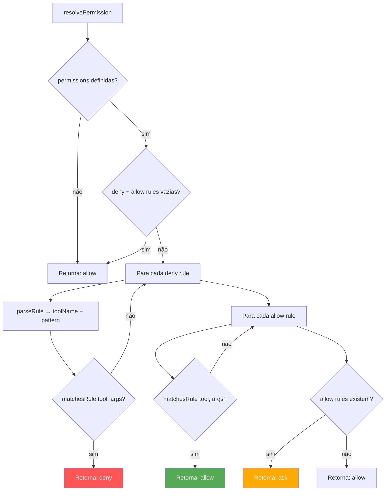
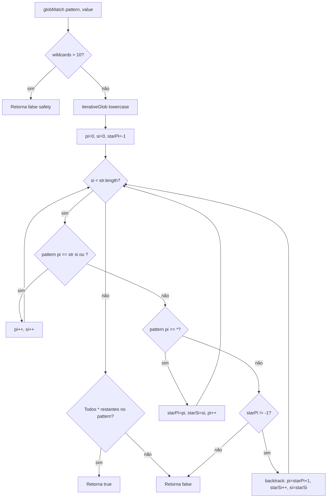

# Flowchart — Módulo Permissions

> Gerado pelo Arqueólogo (Reversa) em 2026-06-23

```mermaid
flowchart TD
    A[resolvePermission] --> B{permissions definidas?}
    B -->|não| C[Retorna: allow]
    B -->|sim| D{deny + allow rules vazias?}
    D -->|sim| C
    D -->|não| E[Para cada deny rule]
    E --> F[parseRule → toolName + pattern]
    F --> G{matchesRule tool, args?}
    G -->|sim| H[Retorna: deny]
    G -->|não| E
    E --> I[Para cada allow rule]
    I --> J{matchesRule tool, args?}
    J -->|sim| K[Retorna: allow]
    J -->|não| I
    I --> L{allow rules existem?}
    L -->|sim| M[Retorna: ask]
    L -->|não| N[Retorna: allow]

    style H fill:#f55,color:#fff
    style K fill:#5a5,color:#fff
    style M fill:#fa0,color:#fff
```

## Glob Match (Iterativo, anti-ReDoS)

```mermaid
flowchart TD
    A[globMatch pattern, value] --> B{wildcards > 10?}
    B -->|sim| C[Retorna false safety]
    B -->|não| D[iterativeGlob lowercase]
    D --> E[pi=0, si=0, starPi=-1]
    E --> F{si < str.length?}
    F -->|não| G{Todos * restantes no pattern?}
    G -->|sim| H[Retorna true]
    G -->|não| I[Retorna false]
    F -->|sim| J{pattern pi == str si ou ?}
    J -->|sim| K[pi++, si++]
    K --> F
    J -->|não| L{pattern pi == *?}
    L -->|sim| M[starPi=pi, starSi=si, pi++]
    M --> F
    L -->|não| N{starPi != -1?}
    N -->|sim| O[backtrack: pi=starPi+1, starSi++, si=starSi]
    O --> F
    N -->|não| I
```
