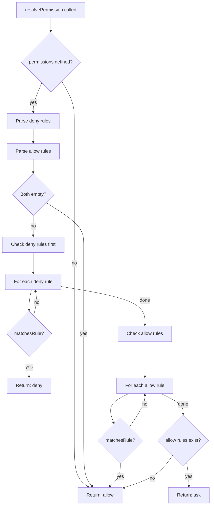
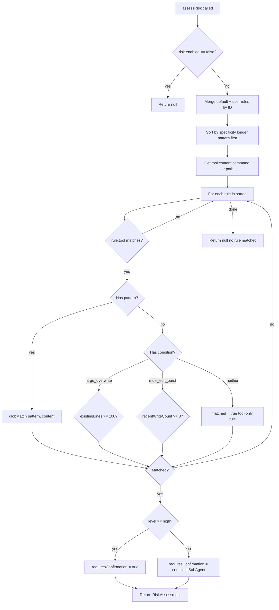
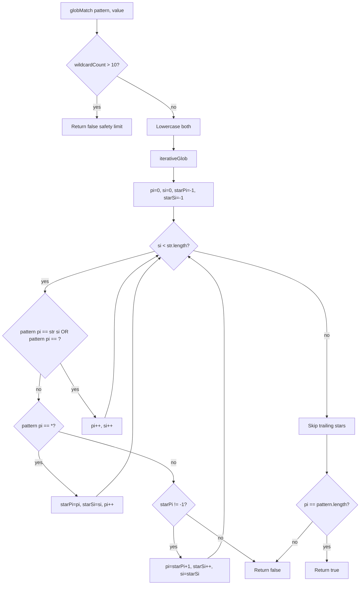
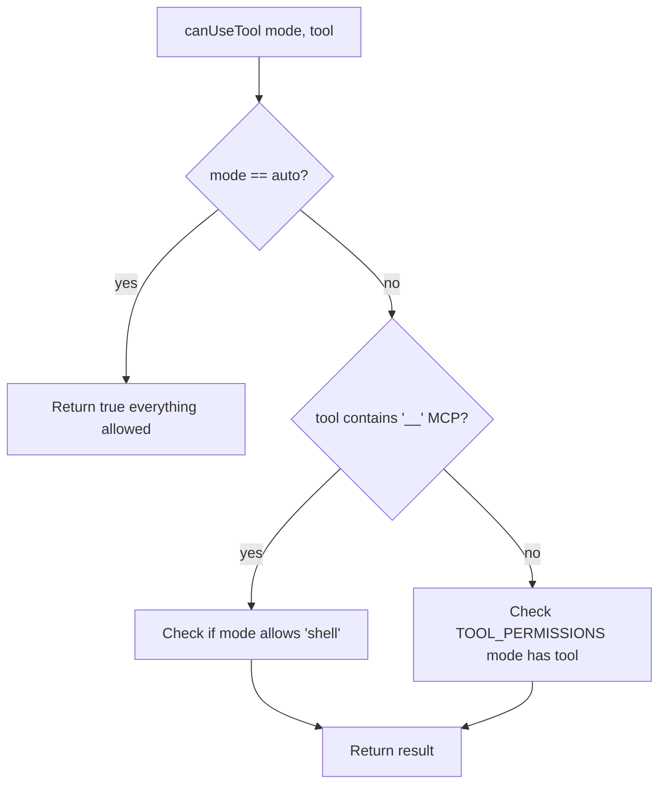

# Flowchart: Permissions Module

> Confidence: 🟢 CONFIRMED  
> Generated at: 2026-07-01

## Permission Resolution



## Risk Assessment



## Iterative Glob Matching (Anti-ReDoS)



## Interaction Mode — Tool Access Matrix



### Tool Permissions by Mode

```
plan:  read_file, read_folder, glob, grep, git, web_fetch, introspect, todo, subagent
build: plan tools + shell, write_file, patch_file, update_knowledge
auto:  ALL tools, zero restrictions
```
