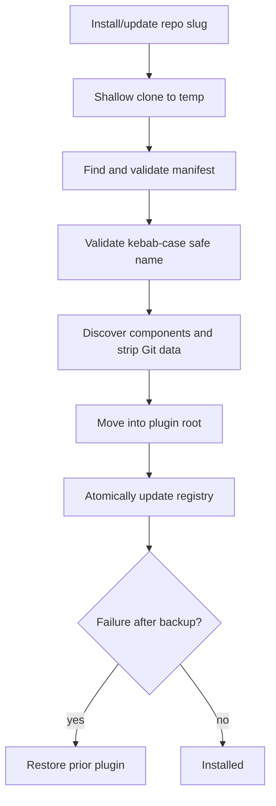

# Plugin lifecycle

```mermaid
flowchart TD
  A[Install/update repo slug] --> B[Shallow clone to temp]
  B --> C[Find and validate manifest]
  C --> D[Validate kebab-case safe name]
  D --> E[Discover components and strip Git data]
  E --> F[Move into plugin root]
  F --> G[Atomically update registry]
  G --> H{Failure after backup?}
  H -->|yes| I[Restore prior plugin]
  H -->|no| J[Installed]
```
