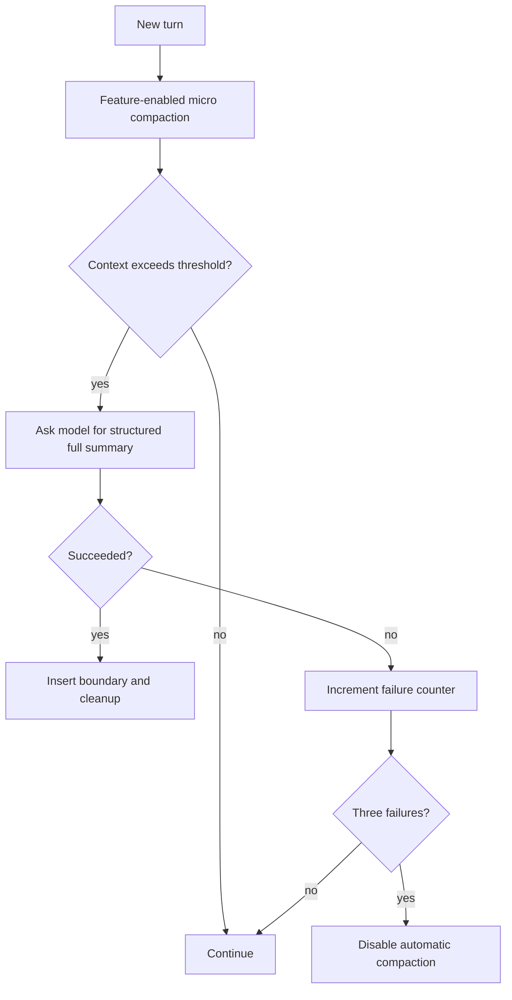

# Compaction flow

```mermaid
flowchart TD
  A[New turn] --> B[Feature-enabled micro compaction]
  B --> C{Context exceeds threshold?}
  C -->|no| D[Continue]
  C -->|yes| E[Ask model for structured full summary]
  E --> F{Succeeded?}
  F -->|yes| G[Insert boundary and cleanup]
  F -->|no| H[Increment failure counter]
  H --> I{Three failures?}
  I -->|yes| J[Disable automatic compaction]
  I -->|no| D
```
