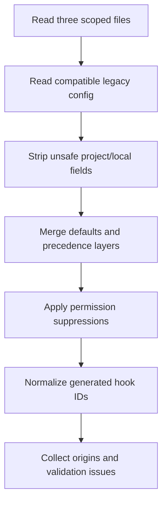

# `loadSettingsSnapshot()` detail

```mermaid
flowchart TD
  A[Read three scoped files] --> B[Read compatible legacy config]
  B --> C[Strip unsafe project/local fields]
  C --> D[Merge defaults and precedence layers]
  D --> E[Apply permission suppressions]
  E --> F[Normalize generated hook IDs]
  F --> G[Collect origins and validation issues]
```
