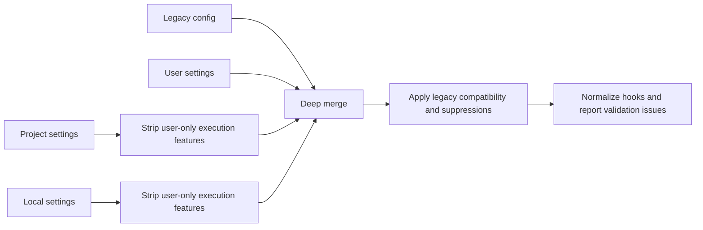

# Settings resolution flow

```mermaid
flowchart LR
  A[Legacy config] --> E[Deep merge]
  B[User settings] --> E
  C[Project settings] --> D[Strip user-only execution features]
  D --> E
  F[Local settings] --> G[Strip user-only execution features]
  G --> E
  E --> H[Apply legacy compatibility and suppressions]
  H --> I[Normalize hooks and report validation issues]
```
