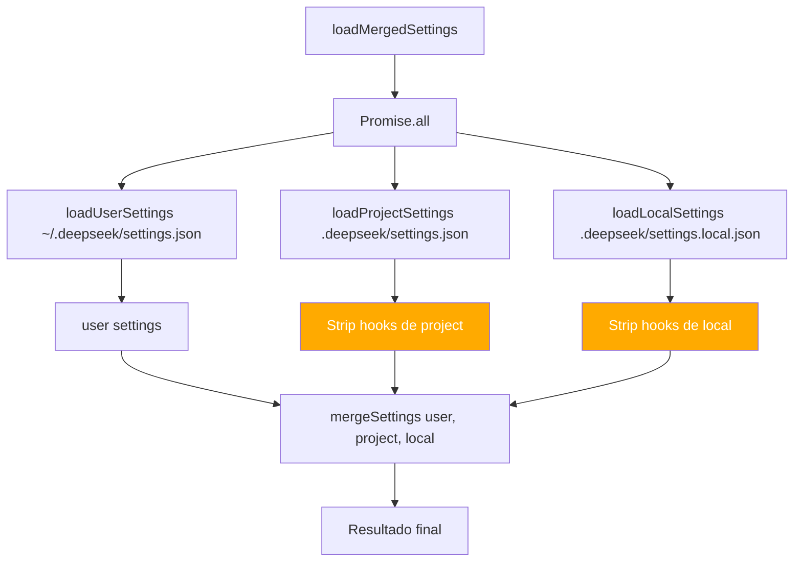
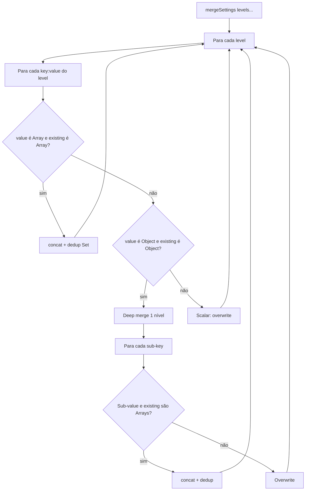

# Flowchart — Módulo Settings

> Gerado pelo Arqueólogo (Reversa) em 2026-06-23

```mermaid
flowchart TD
    A[loadMergedSettings] --> B[Promise.all]
    B --> C[loadUserSettings ~/.deepseek/settings.json]
    B --> D[loadProjectSettings .deepseek/settings.json]
    B --> E[loadLocalSettings .deepseek/settings.local.json]
    C --> F[user settings]
    D --> G[Strip hooks de project]
    E --> H[Strip hooks de local]
    F --> I[mergeSettings user, project, local]
    G --> I
    H --> I
    I --> J[Resultado final]

    style G fill:#fa0,color:#fff
    style H fill:#fa0,color:#fff
```

## Merge Strategy

```mermaid
flowchart TD
    A[mergeSettings levels...] --> B[Para cada level]
    B --> C[Para cada key:value do level]
    C --> D{value é Array e existing é Array?}
    D -->|sim| E[concat + dedup Set]
    D -->|não| F{value é Object e existing é Object?}
    F -->|sim| G[Deep merge 1 nível]
    G --> G1[Para cada sub-key]
    G1 --> G2{Sub-value e existing são Arrays?}
    G2 -->|sim| G3[concat + dedup]
    G2 -->|não| G4[Overwrite]
    F -->|não| H[Scalar: overwrite]
    E --> B
    G3 --> B
    G4 --> B
    H --> B
```
