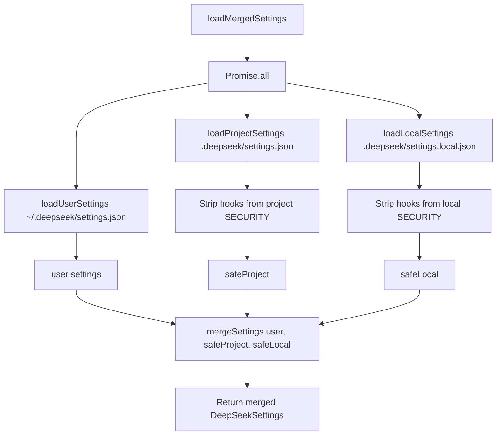
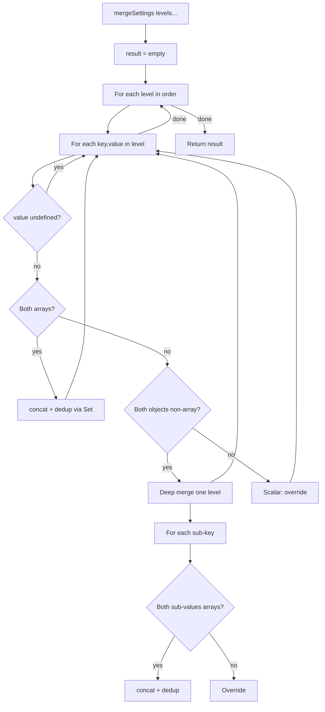
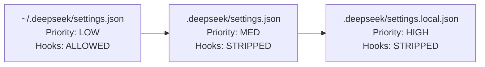

# Flowchart: Settings Module

> Confidence: 🟢 CONFIRMED  
> Generated at: 2026-07-01

## Settings Loading and Merge

```mermaid
flowchart TD
    A[loadMergedSettings] --> B[Promise.all]
    B --> C[loadUserSettings ~/.deepseek/settings.json]
    B --> D[loadProjectSettings .deepseek/settings.json]
    B --> E[loadLocalSettings .deepseek/settings.local.json]
    
    C --> F[user settings]
    D --> G[Strip hooks from project SECURITY]
    E --> H[Strip hooks from local SECURITY]
    
    G --> I[safeProject]
    H --> J[safeLocal]
    
    F --> K[mergeSettings user, safeProject, safeLocal]
    I --> K
    J --> K
    
    K --> L[Return merged DeepSeekSettings]
```

## Merge Algorithm

```mermaid
flowchart TD
    A[mergeSettings levels...] --> B[result = empty]
    B --> C[For each level in order]
    C --> D[For each key,value in level]
    
    D --> E{value undefined?}
    E -->|yes| D
    E -->|no| F{Both arrays?}
    
    F -->|yes| G[concat + dedup via Set]
    F -->|no| H{Both objects non-array?}
    
    H -->|yes| I[Deep merge one level]
    H -->|no| J[Scalar: override]
    
    I --> K[For each sub-key]
    K --> L{Both sub-values arrays?}
    L -->|yes| M[concat + dedup]
    L -->|no| N[Override]
    
    G --> D
    I --> D
    J --> D
    D -->|done| C
    C -->|done| O[Return result]
```

## Settings File Resolution

```mermaid
flowchart LR
    USER[~/.deepseek/settings.json<br/>Priority: LOW<br/>Hooks: ALLOWED] --> PROJECT
    PROJECT[.deepseek/settings.json<br/>Priority: MED<br/>Hooks: STRIPPED] --> LOCAL
    LOCAL[.deepseek/settings.local.json<br/>Priority: HIGH<br/>Hooks: STRIPPED]
```
