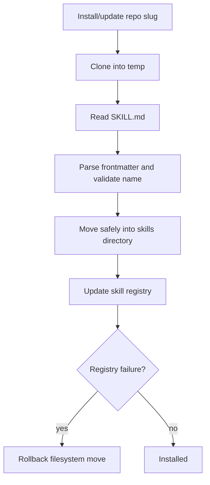

# Skill lifecycle

```mermaid
flowchart TD
  A[Install/update repo slug] --> B[Clone into temp]
  B --> C[Read SKILL.md]
  C --> D[Parse frontmatter and validate name]
  D --> E[Move safely into skills directory]
  E --> F[Update skill registry]
  F --> G{Registry failure?}
  G -->|yes| H[Rollback filesystem move]
  G -->|no| I[Installed]
```
