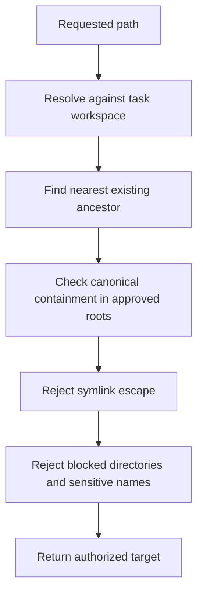

# `resolveSafePath()` detail

```mermaid
flowchart TD
  A[Requested path] --> B[Resolve against task workspace]
  B --> C[Find nearest existing ancestor]
  C --> D[Check canonical containment in approved roots]
  D --> E[Reject symlink escape]
  E --> F[Reject blocked directories and sensitive names]
  F --> G[Return authorized target]
```
