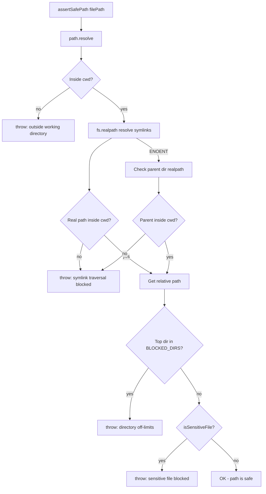
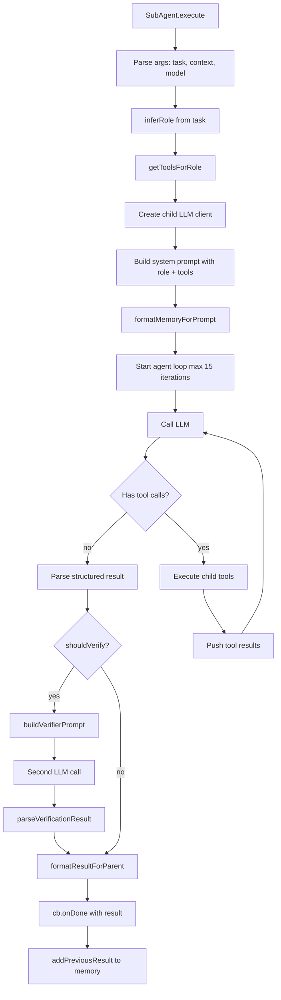
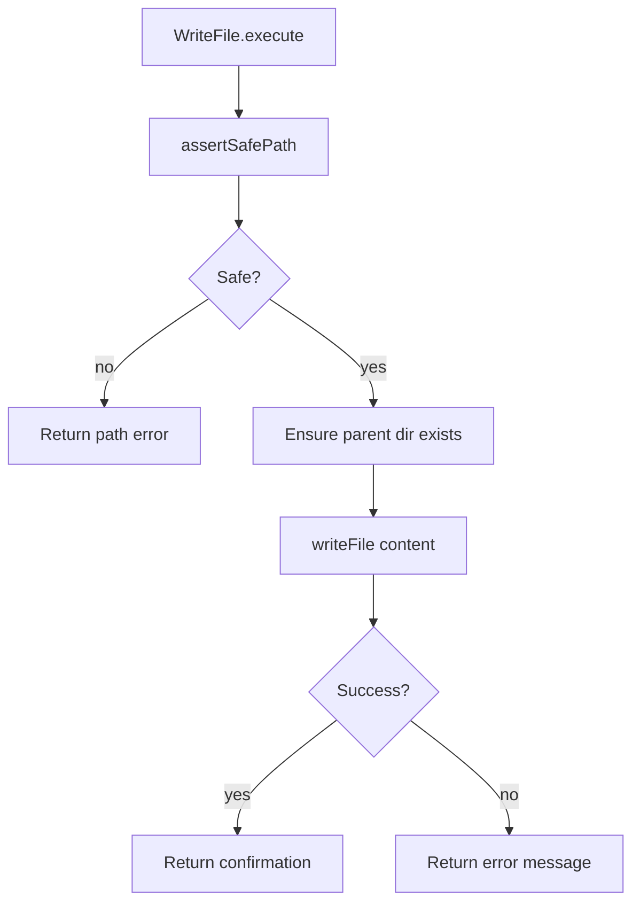
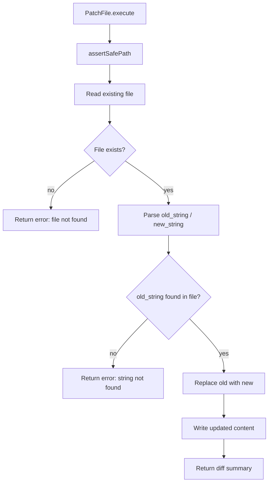
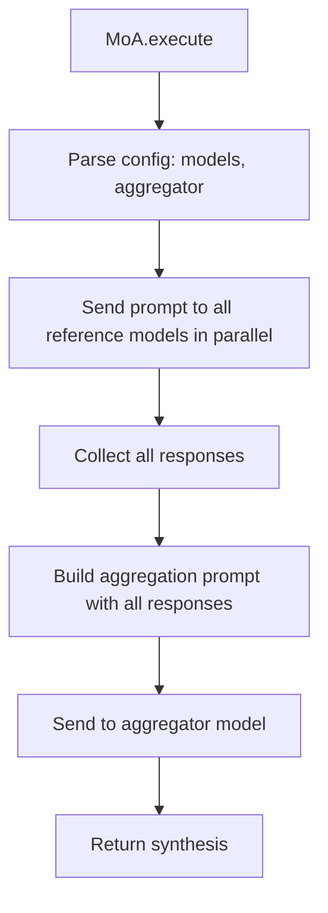
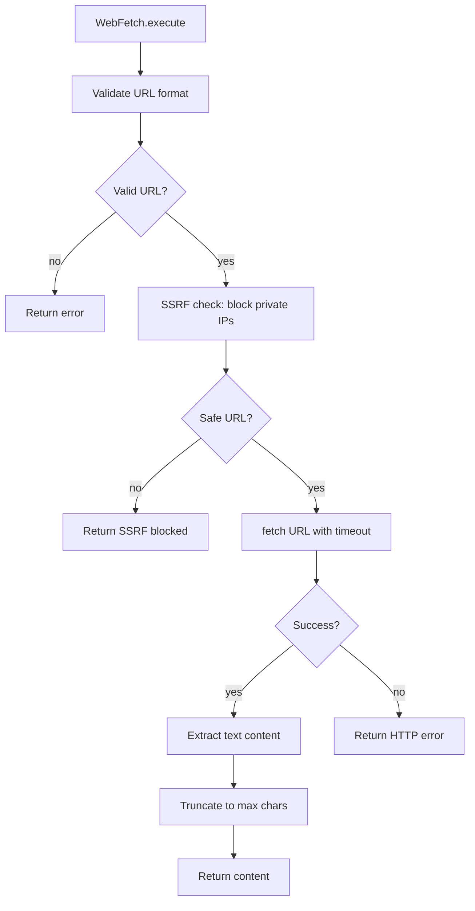

# Flowchart: Tools Module

> Confidence: 🟢 CONFIRMED  
> Generated at: 2026-07-01

## Tool Execution Pipeline

```mermaid
flowchart TD
    A[Agent calls executeTool] --> B[Lookup tool in toolMap]
    B --> C{Tool found?}
    C -->|no| D[Return "Unknown tool: name"]
    C -->|yes| E[validateToolArguments]
    E --> F{Valid?}
    F -->|no| G[Return error: invalid/missing params]
    F -->|yes| H[tool.execute args]
    H --> I{Success?}
    I -->|yes| J[Return result string]
    I -->|no| K[Return "Error: message"]
```

## Shell Tool — Execution Flow

```mermaid
flowchart TD
    A[Shell.execute] --> B[isDestructive check]
    B --> C{Destructive?}
    C -->|yes| D{confirmHandler exists?}
    D -->|no| E[Return error: no handler]
    D -->|yes| F[Ask user confirmation]
    F --> G{Confirmed?}
    G -->|no| H[Return "Cancelled"]
    G -->|yes| I[Execute command]
    C -->|no| I
    I --> J[execa with timeout]
    J --> K{Exit code 0?}
    K -->|yes| L[Return stdout truncated to 50k chars]
    K -->|no| M[Return stderr + exit code]
    J -->|timeout| N[Return timeout error]
```

## pathSafety.assertSafePath()



## SubAgent — Spawn and Execute



## WriteFile — File Creation/Overwrite



## PatchFile — LCS Diff Patching



## MoA — Mixture of Agents



## WebFetch — URL Fetching


