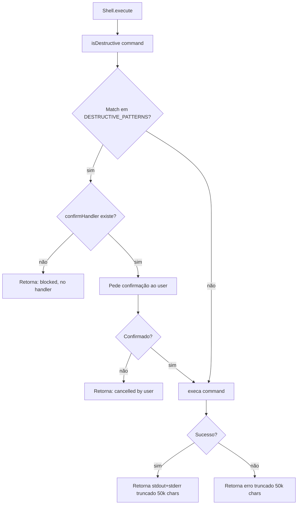
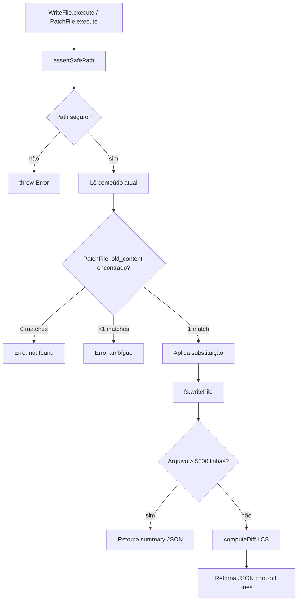
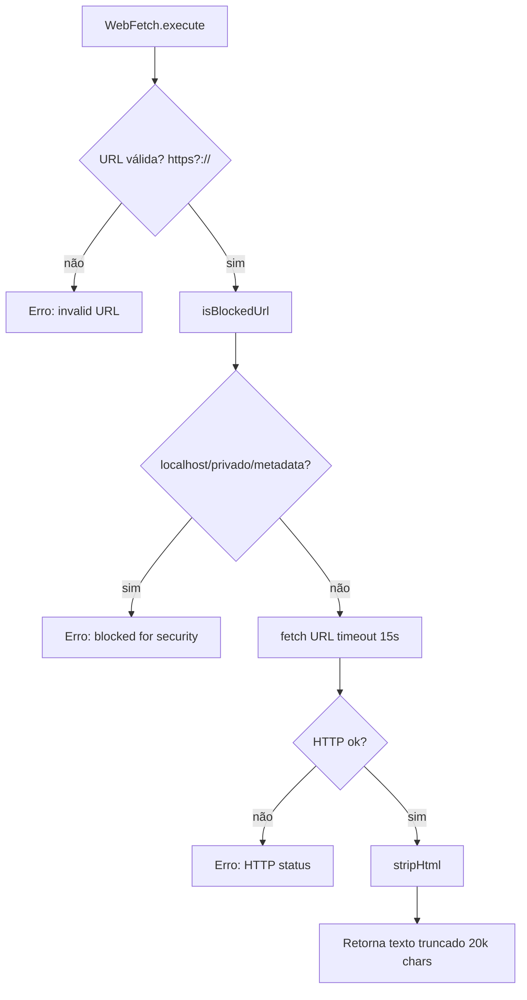
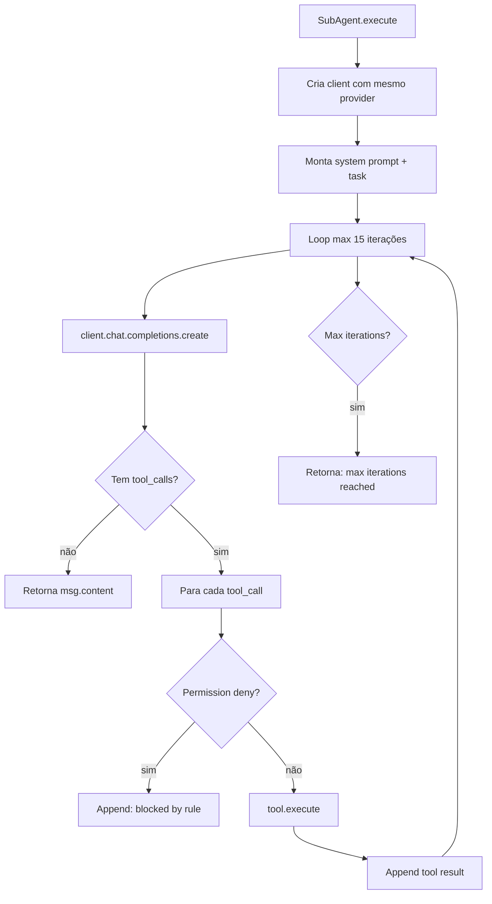

# Flowchart — Módulo Tools (Execução de Ferramentas)

> Gerado pelo Arqueólogo (Reversa) em 2026-06-23

```mermaid
flowchart TD
    A[Agent chama executeTool] --> B{Tool existe no toolMap?}
    B -->|não| C[Retorna "Unknown tool: name"]
    B -->|sim| D[validateToolArguments]
    D --> E{Validação ok?}
    E -->|não| F[Retorna erro com params válidos]
    E -->|sim| G[tool.execute args]
    G --> H{Exceção?}
    H -->|sim| I[Retorna "Error: message"]
    H -->|não| J[Retorna resultado string]
```

## Shell — Fluxo de Segurança



## WriteFile / PatchFile — Fluxo com Diff



## WebFetch — Proteção SSRF



## SubAgent — Loop Independente


