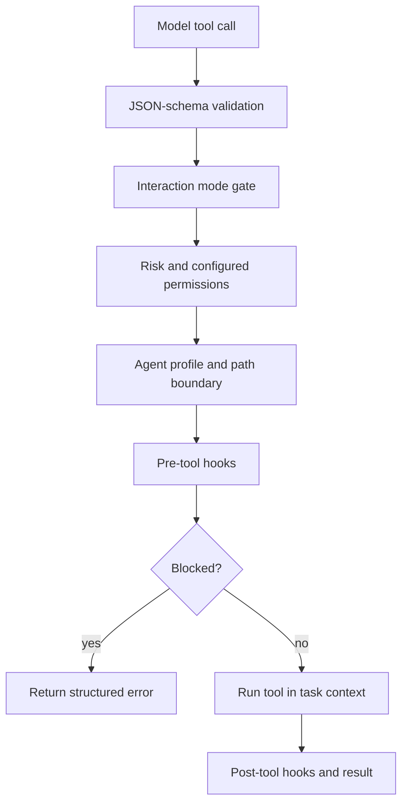

# Tool execution flow

```mermaid
flowchart TD
  A[Model tool call] --> B[JSON-schema validation]
  B --> C[Interaction mode gate]
  C --> D[Risk and configured permissions]
  D --> E[Agent profile and path boundary]
  E --> F[Pre-tool hooks]
  F --> G{Blocked?}
  G -->|yes| H[Return structured error]
  G -->|no| I[Run tool in task context]
  I --> J[Post-tool hooks and result]
```
