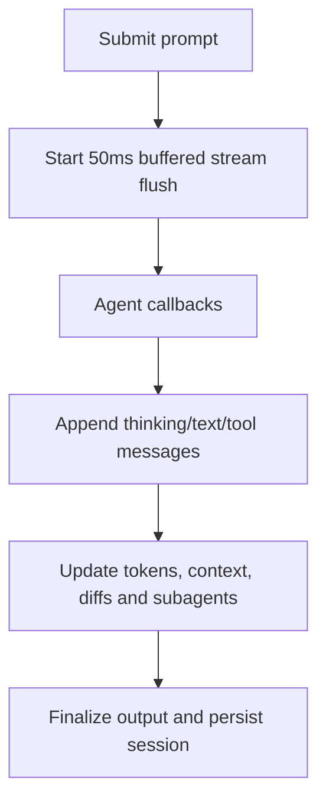

# UI `runAgent()` detail

```mermaid
flowchart TD
  A[Submit prompt] --> B[Start 50ms buffered stream flush]
  B --> C[Agent callbacks]
  C --> D[Append thinking/text/tool messages]
  D --> E[Update tokens, context, diffs and subagents]
  E --> F[Finalize output and persist session]
```
