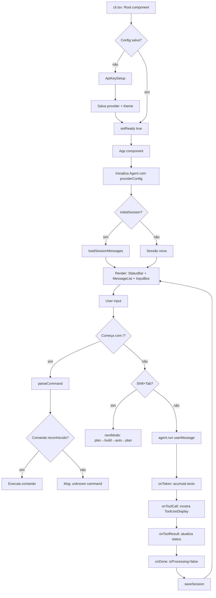
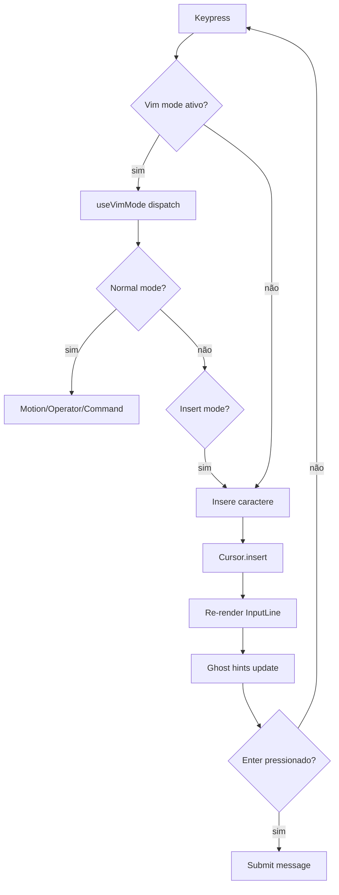
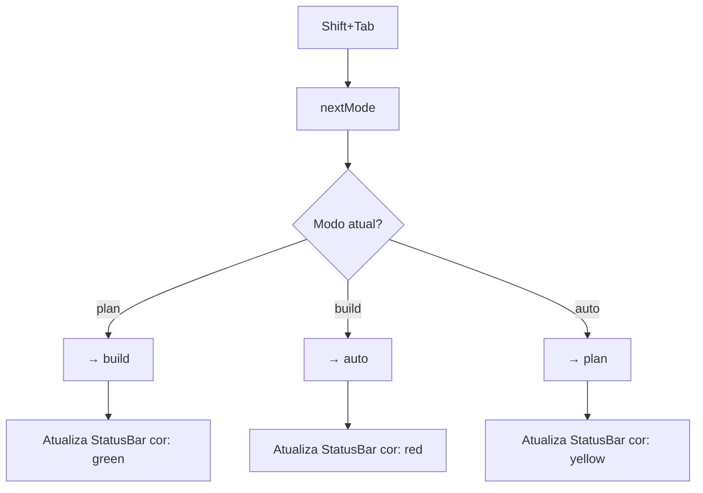

# Flowchart — Módulo UI (Aplicação)

> Gerado pelo Arqueólogo (Reversa) em 2026-06-23

```mermaid
flowchart TD
    A[cli.tsx: Root component] --> B{Config salva?}
    B -->|não| C[ApiKeySetup]
    C --> D[Salva provider + theme]
    D --> E[setReady true]
    B -->|sim| E
    E --> F[App component]

    F --> G[Inicializa Agent com providerConfig]
    G --> H{initialSession?}
    H -->|sim| I[loadSessionMessages]
    H -->|não| J[Sessão nova]
    I --> K[Render: StatusBar + MessageList + InputBox]
    J --> K

    K --> L[User input]
    L --> M{Começa com /?}
    M -->|sim| N[parseCommand]
    N --> O{Comando reconhecido?}
    O -->|sim| P[Executa comando]
    O -->|não| Q[Msg: unknown command]
    M -->|não| R{Shift+Tab?}
    R -->|sim| S[nextMode: plan→build→auto→plan]
    R -->|não| T[agent.run userMessage]
    T --> U[onToken: acumula texto]
    U --> V[onToolCall: mostra ToolUseDisplay]
    V --> W[onToolResult: atualiza status]
    W --> X[onDone: isProcessing=false]
    X --> Y[saveSession]
    Y --> K
```

## Input System

```mermaid
flowchart TD
    A[Keypress] --> B{Vim mode ativo?}
    B -->|sim| C[useVimMode dispatch]
    C --> D{Normal mode?}
    D -->|sim| E[Motion/Operator/Command]
    D -->|não| F{Insert mode?}
    F -->|sim| G[Insere caractere]
    B -->|não| G
    G --> H[Cursor.insert]
    H --> I[Re-render InputLine]
    I --> J[Ghost hints update]
    J --> K{Enter pressionado?}
    K -->|sim| L[Submit message]
    K -->|não| A
```

## Interaction Modes

```mermaid
flowchart TD
    A[Shift+Tab] --> B[nextMode]
    B --> C{Modo atual?}
    C -->|plan| D[→ build]
    C -->|build| E[→ auto]
    C -->|auto| F[→ plan]
    D --> G[Atualiza StatusBar cor: green]
    E --> H[Atualiza StatusBar cor: red]
    F --> I[Atualiza StatusBar cor: yellow]
```
