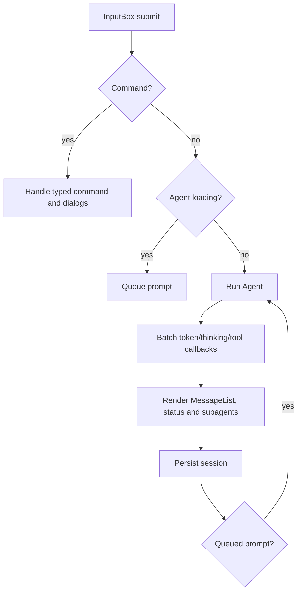

# UI turn flow

```mermaid
flowchart TD
  A[InputBox submit] --> B{Command?}
  B -->|yes| C[Handle typed command and dialogs]
  B -->|no| D{Agent loading?}
  D -->|yes| E[Queue prompt]
  D -->|no| F[Run Agent]
  F --> G[Batch token/thinking/tool callbacks]
  G --> H[Render MessageList, status and subagents]
  H --> I[Persist session]
  I --> J{Queued prompt?}
  J -->|yes| F
```
