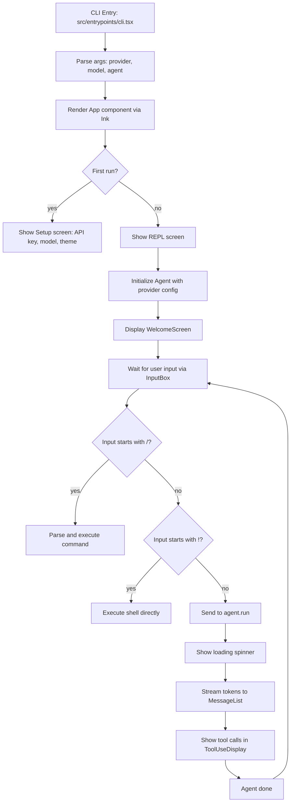
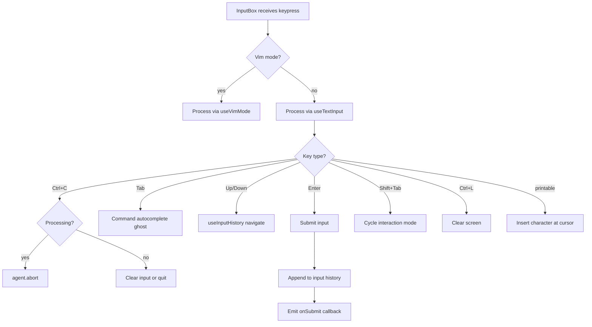
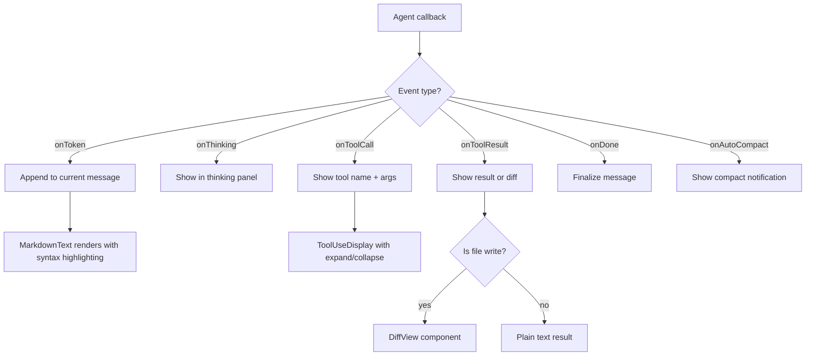
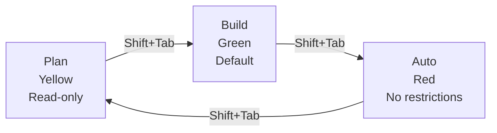
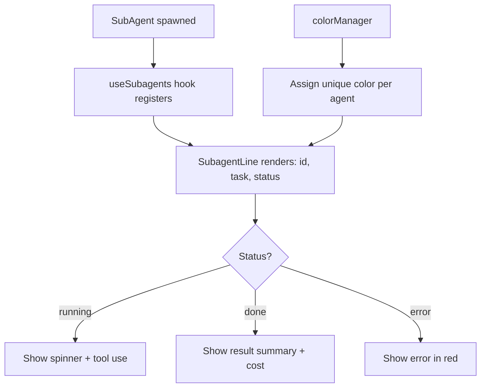
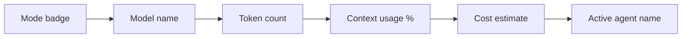

# Flowchart: UI Module

> Confidence: 🟢 CONFIRMED  
> Generated at: 2026-07-01

## App.tsx — Main Application Flow

## InputBox Component

## Message Rendering Pipeline

## Interaction Mode Cycling

## SubagentList — Multi-Agent Display

## StatusBar Layout

