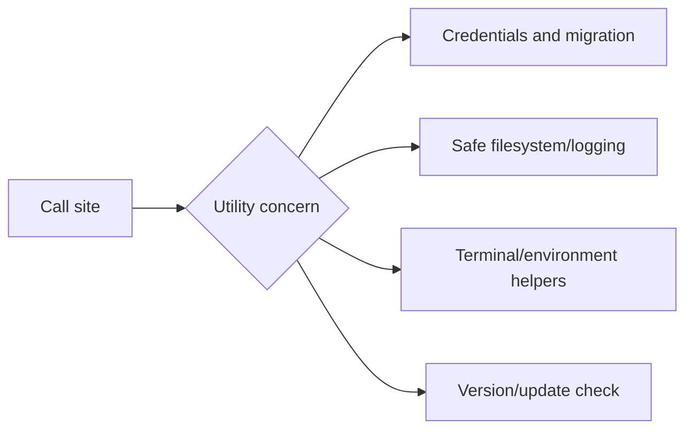

# Utility flow

```mermaid
flowchart LR
  A[Call site] --> B{Utility concern}
  B --> C[Credentials and migration]
  B --> D[Safe filesystem/logging]
  B --> E[Terminal/environment helpers]
  B --> F[Version/update check]
```
