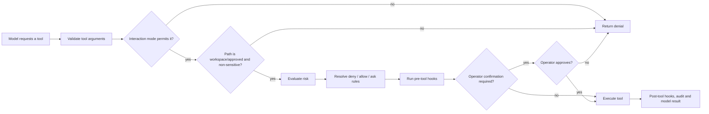

# Authority and permission model

_Re-extracted on 2026-08-01. This is a local-tool authorization model, not application RBAC._

## Decision pipeline

## Interaction modes

| Capability | Plan | Review | Build | Auto |
| --- | --- | --- | --- | --- |
| Read/search/LSP/web/git inspection/memory | allowed | allowed | allowed | allowed |
| Write or patch workspace files | denied | denied | allowed | allowed |
| Shell and MCP tools | denied | denied | allowed | allowed |
| Delegate / ask subagent | denied | denied | allowed | allowed |
| Write or submit plan | allowed | denied | denied | allowed |
| Tools not named by the mode list | denied | denied | denied | allowed |
| Model may activate mode | yes | yes | yes | **no** |

`auto` bypasses only this table; it does not bypass schema validation, filesystem safety, risk evaluation, configured rules, hooks, or confirmations. 🟢

## Subagent roles and orchestration profiles

| Role/profile | Read/search | Write/patch | Shell | LSP/web | Purpose |
| --- | --- | --- | --- | --- | --- |
| `reader` / `researcher-readonly` | yes | no | no | yes | Inspect and report. |
| `reviewer` | yes | no | no | LSP only | Audit without side effects. |
| `writer` | yes | yes | no | no | Edit without command execution. |
| `executor` | yes | yes | yes | web | Explicit development/test execution. |
| `tester` | yes | no | yes | no | Run checks without edits. |
| `writer-worktree` | yes | yes | yes | no | Modify isolated worktree. |
| `coordinator-integrator` / `unrestricted` | all | all | all | all | Integration or explicitly unrestricted task. |

The inferred role defaults to read-only when wording is ambiguous. Subagent calls are additionally risk-assessed; confirmation-required operations are denied to them rather than delegated to an invisible prompt. 🟢

## Filesystem and extension boundaries

| Boundary | Enforcement | Confidence |
| --- | --- | --- |
| Workspace | Canonical resolution and nearest-existing-ancestor checks prevent traversal and symlink escape. | 🟢 |
| External path | Requires a recorded, explicit approval; it is not silently treated as workspace content. | 🟢 |
| Sensitive paths | Credentials, secret-like files and protected implementation directories are blocked even when a path is otherwise reachable. | 🟢 |
| Project configuration | Project/local settings cannot enable executable hooks, LSP commands, project MCP, or default `auto`. | 🟢 |
| MCP | Project `.deepseek/mcp.json` stays inactive until user-scope opt-in and restart; stdio gets a minimal environment. | 🟢 |
| Plugin / skill sources | Names and layouts are validated; updates preserve a recoverable backup until replacement succeeds. | 🟢 |

## Configured permission and risk rules

1. A matching deny rule wins first.
2. A matching allow rule is considered next.
3. With only deny rules configured, unmatched actions are allowed by that rule layer; otherwise unmatched actions ask.
4. Risk remains authoritative: destructive shell operations, broad writes, configuration writes, deployments and similar built-in high-risk actions require confirmation. Low-risk auto-approval does not suppress high risk.
5. Session approval can remember an operator approval only for the live session and matching risk key.

The implementation caps wildcard complexity while parsing permission patterns, limiting patterns to ten wildcard segments to keep authorization matching bounded. 🟢

## Auditability

Tool decisions and results may be written to a local JSONL audit log. Known secret names and values are redacted, and sensitive operational files use restrictive permissions where the filesystem supports them. 🟢
