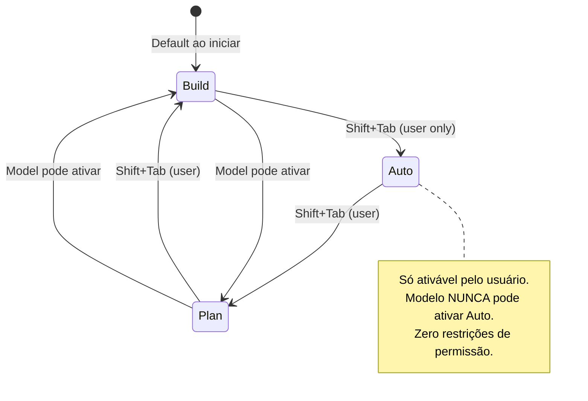
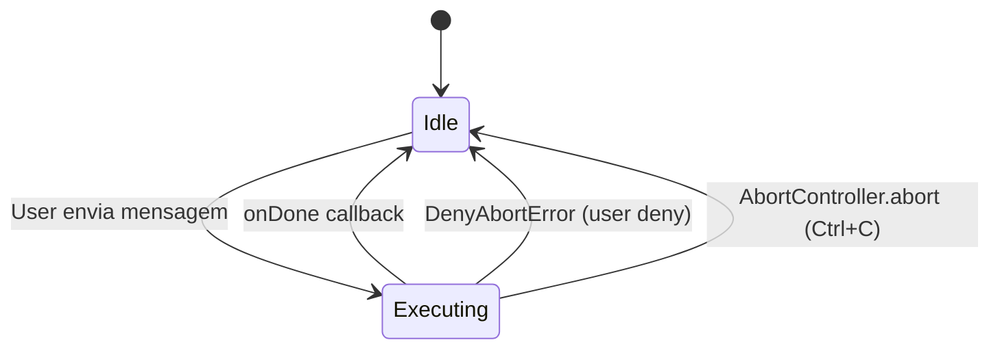
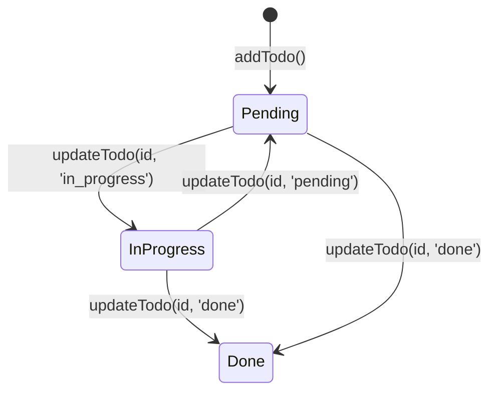
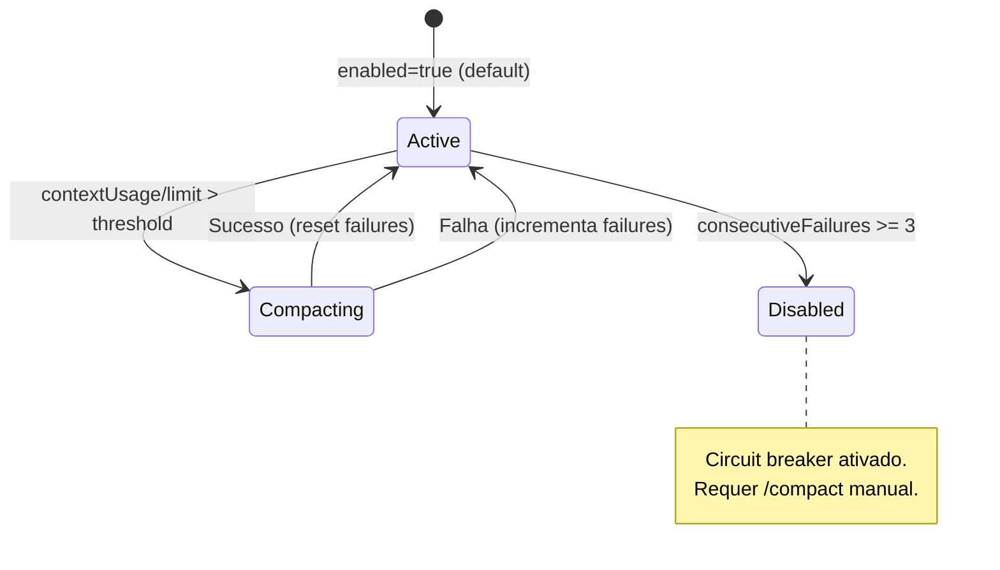
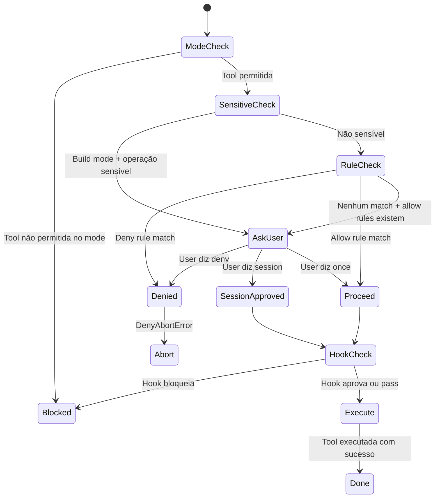
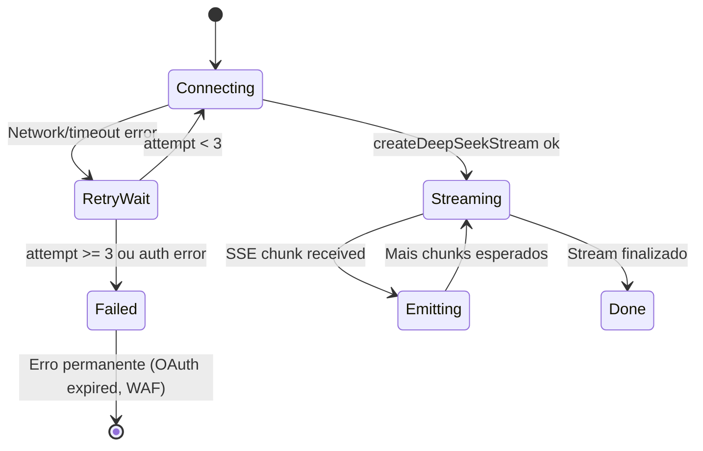

# Máquinas de Estado — deepseek-code

> Gerado pelo Detetive (Reversa) em 2026-06-23
> Escala de confiança: 🟢 CONFIRMADO | 🟡 INFERIDO | 🔴 LACUNA

---

## 1. Interaction Mode (Agent)

🟢 CONFIRMADO — `src/ui/interactionMode.ts`

### Transições

| De | Para | Gatilho | Restrição |
|----|------|---------|-----------|
| Plan | Build | Shift+Tab ou modelo | - |
| Build | Auto | Shift+Tab | Somente usuário |
| Auto | Plan | Shift+Tab | Somente usuário |
| Build | Plan | Modelo ou Shift+Tab | - |

### Permissões por Estado

| Estado | Tools Read-only | Tools Write | Shell Destrutivo | MCP |
|--------|----------------|-------------|------------------|-----|
| Plan | ✅ | ❌ | ❌ | ❌ |
| Build | ✅ | ✅ | ✅ (com confirmação) | ✅ (com confirmação) |
| Auto | ✅ | ✅ | ✅ (sem confirmação) | ✅ (sem confirmação) |

---

## 2. Agent Processing Phase

🟢 CONFIRMADO — `src/ui/App.tsx`

### Estados

| Estado | UI | Agente |
|--------|-------|--------|
| `idle` | InputBox editável | Aguardando input |
| `executing` | LoadingSpinner | Processando (streaming + tool calls) |

---

## 3. Todo Item Status

🟢 CONFIRMADO — `src/agent/todoStore.ts`

### Valores

| Status | Descrição |
|--------|-----------|
| `pending` | Tarefa criada, não iniciada |
| `in_progress` | Em execução |
| `done` | Concluída |

---

## 4. Auto-Compact State Machine

🟢 CONFIRMADO — `src/services/compact/autoCompact.ts`

### Campos de Estado

| Campo | Tipo | Descrição |
|-------|------|-----------|
| `consecutiveFailures` | number | Falhas seguidas (max 3 = desativa) |
| `lastCompactTimestamp` | number | Timestamp do último compact |

---

## 5. Tool Permission Flow

🟡 INFERIDO — `src/agent/agent.ts:914-1006`

---

## 6. Proxy Orchestrator Stream State

🟡 INFERIDO — `src/agent/providers/proxy/services/orchestrator.ts`

